# Orkhon Backend Architecture (Mermaid Diagrams)

> **Visual Architecture Documentation**  
> Comprehensive Mermaid diagrams illustrating the Orkhon backend system components, data flows, and interactions

---

## 📖 Table of Contents

- [System Overview](#system-overview)
- [Component Architecture](#component-architecture)
- [Agent Orchestration](#agent-orchestration)
- [Tool Integration](#tool-integration)
- [ETL Pipeline](#etl-pipeline)
- [Data Flow Patterns](#data-flow-patterns)
- [Deployment Architecture](#deployment-architecture)

---

## System Overview

### High-Level Architecture


**Key Components:**
- **Frontend**: Angular-based UI for agent interaction
- **Agents**: Multi-agent system built with Google ADK
- **Tools**: MCP server managing 84+ DNB API tools
- **ETL**: Data extraction pipelines for analytics
- **External**: DNB APIs and observability backend

---

## Component Architecture

### Directory Structure

```mermaid
graph LR
    subgraph Backend["backend/"]
        ADK["📁 adk/<br/>Agent Development Kit<br/>• Root Agent<br/>• API Coordinators<br/>• API Specialists<br/>• Workflows"]
        APIs["📁 apis/<br/>API Specifications<br/>• OpenAPI 3.0 Specs<br/>• Generated Docs<br/>• API Tests"]
        OpenAPIBox["📁 open-api-box/<br/>OpenAPI Converter<br/>• openapi_toolbox.py<br/>• Schema Validator"]
        Toolbox["📁 toolbox/<br/>MCP Server<br/>• Docker Compose<br/>• Tool Configs<br/>• Health Checks"]
        Clients["📁 clients/<br/>Kiota Clients<br/>• dnb-echo/<br/>• dnb-statistics/<br/>• dnb-public-register/"]
        ETL["📁 etl/<br/>ETL Pipelines<br/>• Statistics ETL<br/>• Public Register ETL<br/>• Orchestrators"]
        Scripts["📁 scripts/<br/>Automation<br/>• start-adk-web.ps1<br/>• generate-clients.ps1<br/>• diagnose-setup.ps1"]
        Data["📁 data/<br/>Data Layers<br/>• 1-bronze/ (Raw)<br/>• 2-silver/ (Cleaned)<br/>• 3-gold/ (Aggregated)"]
    end

    ADK -.Uses.-> Toolbox
    ADK -.Uses.-> Clients
    OpenAPIBox -.Generates.-> Toolbox
    APIs -.Input To.-> OpenAPIBox
    APIs -.Input To.-> Clients
    ETL -.Uses.-> Clients
    ETL -.Writes.-> Data

    classDef primary fill:#bbdefb,stroke:#1976d2,stroke-width:2px
    classDef secondary fill:#c5e1a5,stroke:#558b2f,stroke-width:2px
    classDef utility fill:#ffccbc,stroke:#e64a19,stroke-width:2px
    
    class ADK,Toolbox primary
    class APIs,Clients,ETL secondary
    class OpenAPIBox,Scripts,Data utility
```



**Component Responsibilities:**
- **adk/**: AI agent logic and orchestration
- **apis/**: OpenAPI specs and documentation
- **open-api-box/**: Tool generation automation
- **clients/**: Kiota-generated API clients
- **etl/**: Data extraction pipelines
- **toolbox/**: Runtime tool execution
- **clients/**: Type-safe API clients (Kiota-generated)
- **etl/**: Data extraction and transformation
- **scripts/**: Development and deployment automation
- **data/**: Medallion architecture (Bronze/Silver/Gold layers)

---

## Agent Orchestration

### Multi-Agent Hierarchy

```mermaid
graph TB
    subgraph Root["🎯 Root Agent (gemini-2.0-flash)"]
        RA["root_agent<br/>Main System Coordinator<br/>Routes to Specialists"]
    end

    subgraph Coordinators["🎛️ Coordinator Layer"]
        DNB_Coord["dnb_coordinator<br/>(Toolbox Path)<br/>Routes to MCP Tools"]
        OpenAPI_Coord["dnb_openapi_coordinator<br/>(OpenAPI Path)<br/>Runtime Tool Generation"]
        Google_Coord["google_coordinator<br/>(COMING SOON)<br/>Google API Integration"]
        Data_Coord["data_coordinator<br/>(COMING SOON)<br/>Data Workflows"]
    end

    subgraph Specialists["🔧 Specialist Agents"]
        direction LR
        Echo_TB["dnb_echo_agent<br/>ToolboxToolset<br/>• Connectivity Tests<br/>• Health Checks"]
        Stats_TB["dnb_statistics_agent<br/>ToolboxToolset<br/>• Market Data<br/>• Financial Stats<br/>• 79 endpoints"]
        PR_TB["dnb_public_register_agent<br/>ToolboxToolset<br/>• Entity Search<br/>• Publications<br/>• 5 endpoints"]
    end

    subgraph OpenAPI_Specialists["🆕 OpenAPI Specialists"]
        direction LR
        Echo_OA["dnb_openapi_echo_agent<br/>OpenAPIToolset<br/>Runtime Generation"]
        Stats_OA["dnb_openapi_statistics_agent<br/>OpenAPIToolset<br/>Runtime Generation"]
        PR_OA["dnb_openapi_public_register_agent<br/>OpenAPIToolset<br/>Runtime Generation"]
    end

    subgraph Workflows["⚙️ Workflow Agents"]
        Sequential["data_pipeline<br/>SequentialAgent<br/>• Validate → Transform → Analyze"]
        Parallel["parallel_fetcher<br/>ParallelAgent<br/>• Fan-out/Fan-in Pattern"]
    end

    RA --> DNB_Coord
    RA --> OpenAPI_Coord
    RA -.Future.-> Google_Coord
    RA -.Future.-> Data_Coord
    
    DNB_Coord --> Echo_TB
    DNB_Coord --> Stats_TB
    DNB_Coord --> PR_TB
    
    OpenAPI_Coord --> Echo_OA
    OpenAPI_Coord --> Stats_OA
    OpenAPI_Coord --> PR_OA
    
    Data_Coord -.-> Sequential
    Data_Coord -.-> Parallel

    classDef root fill:#ffebee,stroke:#c62828,stroke-width:3px
    classDef coordinator fill:#e1f5fe,stroke:#0277bd,stroke-width:2px
    classDef specialist fill:#f3e5f5,stroke:#7b1fa2,stroke-width:2px
    classDef openapi fill:#e8f5e9,stroke:#2e7d32,stroke-width:2px
    classDef workflow fill:#fff9c4,stroke:#f57f17,stroke-width:2px
    
    class RA root
    class DNB_Coord,OpenAPI_Coord,Google_Coord,Data_Coord coordinator
    class Echo_TB,Stats_TB,PR_TB specialist
    class Echo_OA,Stats_OA,PR_OA openapi
    class Sequential,Parallel workflow
```



**Agent Types:**
- **Root Agent**: Entry point, intelligent routing based on user intent
- **Coordinators**: Domain-specific routers (DNB, Google, Data)
- **Specialists**: Single-API experts with focused capabilities
- **Workflows**: Deterministic orchestration patterns

**Agent Communication:**
- Uses `transfer_to_agent()` for delegation
- State sharing via `output_key` parameter
- Coordinators aggregate specialist results

---

## Tool Integration

### Tool Lifecycle

```mermaid
sequenceDiagram
    participant Dev as Developer
    participant Spec as OpenAPI Specs
    participant OpenAPIBox as OpenAPI-Box Converter
    participant YAML as Tool YAML Configs
    participant Docker as Docker Compose
    participant Toolbox as GenAI Toolbox
    participant Agent as ADK Agent
    participant API as DNB API

    Dev->>Spec: 1. Update OpenAPI spec
    Dev->>OpenAPIBox: 2. Run conversion
    OpenAPIBox->>Spec: 3. Parse spec
    OpenAPIBox->>YAML: 4. Generate tool definitions
    Note over YAML: 84+ tools defined<br/>• dnb-echo-* (3)<br/>• dnb-statistics-* (79)<br/>• dnb-public-register-* (5)
    
    Dev->>Docker: 5. Restart container
    Docker->>Toolbox: 6. Start MCP server
    Toolbox->>YAML: 7. Load configs
    Toolbox-->>Toolbox: 8. Register tools
    
    Agent->>Toolbox: 9. Discover tools (GET /api/toolset)
    Toolbox-->>Agent: 10. Return tool list + schemas
    
    Agent->>Toolbox: 11. Invoke tool (POST /api/tool/{name}/invoke)
    Toolbox->>API: 12. HTTP request + auth
    API-->>Toolbox: 13. Response
    Toolbox->>Toolbox: 14. Create trace span
    Toolbox-->>Agent: 15. Return result
```



**Tool Definition Structure:**

```yaml
# Example: dnb-echo-helloworld
tools:
  - name: dnb-echo-helloworld
    description: Get hello world message from DNB Echo API
    http:
      url: https://api.dnb.nl/echo-api/helloworld
      method: GET
      headers:
        Ocp-Apim-Subscription-Key: ${DNB_SUBSCRIPTION_KEY_DEV}
        Accept: application/json
```

---

### Toolbox Architecture

```mermaid
graph TB
    subgraph Client["Client Layer"]
        ADK_Agent["ADK Agent<br/>(ToolboxToolset)"]
        LangGraph["LangGraph Agent<br/>(ToolboxClient)"]
    end

    subgraph Toolbox_MCP["GenAI Toolbox MCP Server (Port 5000)"]
        direction TB
        API_Layer["REST API Layer<br/>• /api/toolset<br/>• /api/tools<br/>• /api/tool/{name}/invoke"]
        
        Registry["Tool Registry<br/>• Schema Validation<br/>• Tool Discovery<br/>• Toolset Grouping"]
        
        Executor["HTTP Executor<br/>• Request Building<br/>• Auth Injection<br/>• Response Parsing"]
        
        Telemetry["OpenTelemetry<br/>• Span Creation<br/>• Trace Context<br/>• OTLP Export"]
    end

    subgraph Config["Configuration Layer"]
        DevConfig["config/dev/<br/>• dnb-echo-tools.yaml<br/>• dnb-statistics-tools.yaml<br/>• dnb-public-register-tools.yaml"]
        ProdConfig["config/prod/<br/>• Production configs<br/>• Different endpoints"]
    end

    subgraph External_APIs["External APIs"]
        Echo_API["Echo API<br/>(3 endpoints)"]
        Stats_API["Statistics API<br/>(79 endpoints)"]
        PR_API["Public Register API<br/>(5 endpoints)"]
    end

    subgraph Observability["Observability"]
        Jaeger["Jaeger<br/>Port: 4318 (OTLP)<br/>Port: 16686 (UI)"]
    end

    %% Connections
    ADK_Agent --> API_Layer
    LangGraph --> API_Layer
    
    API_Layer --> Registry
    Registry --> Executor
    Executor --> Telemetry
    
    DevConfig -.Loaded at startup.-> Registry
    ProdConfig -.Loaded at startup.-> Registry
    
    Executor -.HTTPS + API Key.-> Echo_API
    Executor -.HTTPS + API Key.-> Stats_API
    Executor -.HTTPS + API Key.-> PR_API
    
    Telemetry -.OTLP/gRPC.-> Jaeger

    classDef client fill:#e1f5fe,stroke:#01579b,stroke-width:2px
    classDef toolbox fill:#fff3e0,stroke:#e65100,stroke-width:2px
    classDef config fill:#f3e5f5,stroke:#4a148c,stroke-width:2px
    classDef api fill:#e8f5e9,stroke:#1b5e20,stroke-width:2px
    classDef obs fill:#fce4ec,stroke:#880e4f,stroke-width:2px
    
    class ADK_Agent,LangGraph client
    class API_Layer,Registry,Executor,Telemetry toolbox
    class DevConfig,ProdConfig config
    class Echo_API,Stats_API,PR_API api
    class Jaeger obs
```



**Toolbox Responsibilities:**
1. **Tool Management**: Register, validate, and discover tools
2. **Request Handling**: Build HTTP requests with authentication
3. **Observability**: Create distributed traces for debugging
4. **Schema Validation**: Ensure requests match tool definitions

---

## ETL Pipeline

### ETL Architecture Overview

```mermaid
graph LR
    subgraph Sources["üì° Data Sources"]
        Echo["Echo API<br/>(Testing)"]
        Stats["Statistics API<br/>17+ Datasets"]
        PR["Public Register API<br/>6 Categories"]
    end

    subgraph Clients["üîå Kiota Clients"]
        Echo_Client["DnbEchoClient<br/>(Type-safe)"]
        Stats_Client["DnbStatisticsClient<br/>(Type-safe)"]
        PR_Client["DnbPublicRegisterClient<br/>(Type-safe)"]
    end

    subgraph ETL_Pipelines["⚙️ ETL Pipelines"]
        direction TB
        Stats_ETL["Statistics ETL<br/>• 17+ Extractors<br/>• Smart Pagination<br/>• Metadata Tracking"]
        PR_ETL["Public Register ETL<br/>• 6 Extractors<br/>• Multi-register Support<br/>• Multi-language"]
    end

    subgraph Orchestration["🎛️ Orchestration"]
        Stats_Orch["Statistics Orchestrator<br/>• --all / --endpoints<br/>• --category<br/>• --dry-run"]
        PR_Orch["Public Register Orchestrator<br/>• --metadata / --organizations<br/>• --publications / --registrations<br/>• --register / --language"]
    end

    subgraph Storage["üíæ Data Lake (Medallion)"]
        Bronze["🥉 Bronze Layer<br/>data/1-bronze/<br/>• Raw Parquet Files<br/>• Directly from API<br/>• Append-only"]
        Silver["🥈 Silver Layer<br/>data/2-silver/<br/>• Cleaned & Deduplicated<br/>• Type-safe Schemas<br/>(PLANNED)"]
        Gold["🥇 Gold Layer<br/>data/3-gold/<br/>• Business Aggregations<br/>• Analytics-ready<br/>(PLANNED)"]
    end

    %% Connections
    Stats --> Stats_Client
    PR --> PR_Client
    Echo --> Echo_Client
    
    Stats_Client --> Stats_ETL
    PR_Client --> PR_ETL
    
    Stats_ETL --> Stats_Orch
    PR_ETL --> PR_Orch
    
    Stats_Orch --> Bronze
    PR_Orch --> Bronze
    
    Bronze -.Transform.-> Silver
    Silver -.Aggregate.-> Gold

    classDef source fill:#e8f5e9,stroke:#2e7d32,stroke-width:2px
    classDef client fill:#e3f2fd,stroke:#1565c0,stroke-width:2px
    classDef etl fill:#fff3e0,stroke:#ef6c00,stroke-width:2px
    classDef orch fill:#f3e5f5,stroke:#6a1b9a,stroke-width:2px
    classDef storage fill:#fce4ec,stroke:#c2185b,stroke-width:2px
    
    class Echo,Stats,PR source
    class Echo_Client,Stats_Client,PR_Client client
    class Stats_ETL,PR_ETL etl
    class Stats_Orch,PR_Orch orch
    class Bronze,Silver,Gold storage
```



**ETL Features:**
- **Type-Safe Clients**: Kiota-generated from OpenAPI specs
- **Smart Pagination**: Automatic handling of paginated responses
- **Metadata Tracking**: Extraction history and lineage
- **Incremental Updates**: Checkpoint-based resumption
- **Multi-format**: Parquet for analytics, JSON for exploration

---

### Statistics ETL Pipeline

```mermaid
graph TB
    subgraph Input["üì• Input"]
        API["DNB Statistics API<br/>v2024100101"]
    end

    subgraph Extractors["üîß Extractors (17+)"]
        direction LR
        ExchangeRates["Exchange Rates<br/>(Day/Week/Month)"]
        InterestRates["Interest Rates<br/>(Market/Policy)"]
        Securities["Securities<br/>(Bond Yields)"]
        BankStats["Bank Statistics<br/>(Assets/Liabilities)"]
        Other["+ 10 more endpoints"]
    end

    subgraph BaseClass["🏗️ Base Classes"]
        PaginatedExtractor["PaginatedExtractor<br/>• Smart pagination<br/>• Rate limiting<br/>• Error handling"]
        Metadata["Metadata Tracker<br/>• Extraction history<br/>• Record counts<br/>• Timestamps"]
    end

    subgraph Orchestrator["🎛️ Orchestrator"]
        CLI["CLI Interface<br/>--all / --endpoints<br/>--category / --list"]
        Coordinator["Coordinator<br/>• Parallel execution<br/>• Error recovery<br/>• Progress logging"]
    end

    subgraph Output["📤 Output"]
        Parquet["Parquet Files<br/>data/1-bronze/market_data/<br/>data/1-bronze/financial_statistics/"]
        MetadataFile["extraction_metadata.json<br/>• Last run timestamp<br/>• Record counts<br/>• File paths"]
    end

    API --> Extractors
    Extractors --> PaginatedExtractor
    PaginatedExtractor --> Metadata
    
    CLI --> Coordinator
    Coordinator --> Extractors
    
    Extractors --> Parquet
    Metadata --> MetadataFile

    classDef input fill:#e8f5e9,stroke:#2e7d32,stroke-width:2px
    classDef extractor fill:#fff3e0,stroke:#ef6c00,stroke-width:2px
    classDef base fill:#e1f5fe,stroke:#0277bd,stroke-width:2px
    classDef orch fill:#f3e5f5,stroke:#6a1b9a,stroke-width:2px
    classDef output fill:#fce4ec,stroke:#c2185b,stroke-width:2px
    
    class API input
    class ExchangeRates,InterestRates,Securities,BankStats,Other extractor
    class PaginatedExtractor,Metadata base
    class CLI,Coordinator orch
    class Parquet,MetadataFile output
```



**Key Extractors:**
- `ExchangeRatesExtractor` - EUR/USD, Gold prices
- `MarketInterestRatesExtractor` - EURIBOR, EONIA
- `BondYieldsExtractor` - Dutch government bonds
- `BankStatisticsExtractor` - Balance sheet items
- 13+ more specialized extractors

---

### Public Register ETL Pipeline

```mermaid
graph TB
    subgraph Input["üì• Input"]
        API["DNB Public Register API<br/>v1"]
    end

    subgraph Discovery["üîç Discovery Phase"]
        Registers["RegistersExtractor<br/>• Discover all registers<br/>• WFTAF, WFT, etc."]
        Languages["LanguagesExtractor<br/>• Supported languages<br/>• NL, EN"]
    end

    subgraph Organizations["🏢 Organizations Phase"]
        RelationNums["RelationNumbersExtractor<br/>• Get org IDs per register<br/>• Paginated (max 1000/page)"]
        OrgDetails["OrganizationDetailsExtractor<br/>• Full org data<br/>• Batch: 25 IDs/request"]
    end

    subgraph Publications["üì∞ Publications Phase"]
        PubSearch["PublicationsSearchExtractor<br/>• Search across all publications<br/>• Filter by register/language"]
        PubDetails["PublicationDetailsExtractor<br/>• Get full publication data<br/>• Per register"]
    end

    subgraph Registrations["üìù Registrations Phase"]
        ActArticles["ActArticleNamesExtractor<br/>• Regulatory metadata<br/>• Per register + language"]
        RegisterArticles["RegisterArticlesExtractor<br/>• Act articles<br/>• Per register"]
    end

    subgraph Orchestrator["🎛️ Orchestrator"]
        CLI["CLI Interface<br/>--metadata / --organizations<br/>--publications / --registrations<br/>--register / --language"]
    end

    subgraph Output["📤 Output"]
        Bronze["Parquet Files<br/>• metadata/ (registers, languages)<br/>• organizations/ (relation_numbers, details)<br/>• publications/ (search, details)<br/>• registrations/ (act_articles)<br/>• register_articles/"]
    end

    API --> Discovery
    Discovery --> Organizations
    Discovery --> Publications
    Discovery --> Registrations
    
    Registers --> RelationNums
    RelationNums --> OrgDetails
    
    Registers --> PubSearch
    PubSearch --> PubDetails
    
    Registers --> ActArticles
    Registers --> RegisterArticles
    
    CLI --> Discovery
    CLI --> Organizations
    CLI --> Publications
    CLI --> Registrations
    
    Organizations --> Bronze
    Publications --> Bronze
    Registrations --> Bronze
    Discovery --> Bronze

    classDef input fill:#e8f5e9,stroke:#2e7d32,stroke-width:2px
    classDef discovery fill:#e1f5fe,stroke:#0277bd,stroke-width:2px
    classDef org fill:#fff3e0,stroke:#ef6c00,stroke-width:2px
    classDef pub fill:#f3e5f5,stroke:#6a1b9a,stroke-width:2px
    classDef reg fill:#fff9c4,stroke:#f57f17,stroke-width:2px
    classDef orch fill:#ffccbc,stroke:#d84315,stroke-width:2px
    classDef output fill:#fce4ec,stroke:#c2185b,stroke-width:2px
    
    class API input
    class Registers,Languages discovery
    class RelationNums,OrgDetails org
    class PubSearch,PubDetails pub
    class ActArticles,RegisterArticles reg
    class CLI orch
    class Bronze output
```



**Extraction Flow:**
1. **Discovery**: Find all registers and languages
2. **Organizations**: Get IDs → Fetch full details (batch of 25)
3. **Publications**: Search → Extract details per register
4. **Registrations**: Get regulatory metadata
5. **All write to Parquet**: Data lake ready for analytics

---

## Data Flow Patterns

### Agent Query Flow (End-to-End)


**Key Points:**
- **Reason-Act Loop**: Gemini analyzes → selects tools → interprets results
- **Transfer Pattern**: Root → Coordinator → Specialist (delegation chain)
- **Output Keys**: Agents share state via named outputs
- **Tracing**: Every tool invocation creates an OTLP span

---

### ETL Data Flow

```mermaid
flowchart TB
    Start([Developer runs ETL])
    
    subgraph Orchestrator["🎛️ Orchestrator"]
        CLI{Parse CLI Args}
        DryRun{Dry Run?}
        SelectEndpoints["Select Endpoints<br/>--all / --endpoints / --category"]
    end
    
    subgraph Extractor["🔧 Extractor"]
        Init["Initialize Extractor<br/>• Create Kiota client<br/>• Setup rate limiter"]
        Extract["Extract Data<br/>• Call API<br/>• Handle pagination<br/>• Parse responses"]
        Transform["Transform Records<br/>• Add ETL metadata<br/>• Flatten nested JSON<br/>• Type conversions"]
    end
    
    subgraph Storage["💾 Storage"]
        Validate["Validate Schema<br/>• Check required fields<br/>• Validate types"]
        WriteParquet["Write Parquet<br/>• Partition by category<br/>• Compress (snappy)<br/>• Add metadata"]
        UpdateMetadata["Update Metadata File<br/>• Extraction timestamp<br/>• Record count<br/>• File path"]
    end
    
    End([Complete])
    
    Start --> CLI
    CLI --> DryRun
    DryRun -->|Yes| ShowPlan["Show Extraction Plan"]
    ShowPlan --> End
    DryRun -->|No| SelectEndpoints
    SelectEndpoints --> Init
    
    Init --> Extract
    Extract --> Transform
    Transform --> Validate
    Validate --> WriteParquet
    WriteParquet --> UpdateMetadata
    UpdateMetadata --> End

    classDef orch fill:#e1f5fe,stroke:#0277bd,stroke-width:2px
    classDef extract fill:#fff3e0,stroke:#ef6c00,stroke-width:2px
    classDef storage fill:#f3e5f5,stroke:#6a1b9a,stroke-width:2px
    classDef terminal fill:#c8e6c9,stroke:#2e7d32,stroke-width:2px
    
    class CLI,DryRun,SelectEndpoints orch
    class Init,Extract,Transform extract
    class Validate,WriteParquet,UpdateMetadata storage
    class Start,End terminal
```



**ETL Features:**
- **Smart Pagination**: Automatically handles large result sets
- **Rate Limiting**: Respects API limits (configurable)
- **Error Recovery**: Checkpoint-based resumption on failure
- **Metadata Tracking**: Full lineage of extractions
- **Incremental Updates**: Skip already-extracted data

---

## Deployment Architecture

### Docker Compose Stack

```mermaid
graph TB
    subgraph Docker["üê≥ Docker Compose (docker-compose.dev.yml)"]
        direction TB
        
        subgraph Network["orkhon-network (Bridge)"]
            Toolbox["genai-toolbox-mcp<br/>Port: 5000<br/>Image: genai-toolbox:dev<br/>Env: DEV"]
            
            Jaeger["jaeger<br/>Ports: 4318 (OTLP), 16686 (UI)<br/>Image: jaegertracing/all-in-one:latest<br/>Storage: In-memory"]
            
            Postgres["postgres<br/>Port: 5432<br/>Image: postgres:15<br/>Volume: postgres_data"]
        end
        
        subgraph Volumes["Volumes"]
            ToolConfig["./config ‚Üí /app/config"]
            PostgresData["postgres_data"]
        end
    end

    subgraph Host["💻 Host Machine"]
        ADK_Web["ADK Web<br/>Port: 4200<br/>Angular Dev Server"]
        Python_Agents["Python Agents<br/>• LangGraph<br/>• ADK Agents<br/>Virtual env: .venv"]
        Browser["Web Browser<br/>• http://localhost:5000/ui<br/>• http://localhost:16686"]
    end

    %% Connections
    Toolbox --> Jaeger
    Toolbox --> Postgres
    ToolConfig -.Mount.-> Toolbox
    PostgresData -.Mount.-> Postgres
    
    ADK_Web -.HTTP.-> Python_Agents
    Python_Agents -.HTTP.-> Toolbox
    Browser -.HTTP.-> Toolbox
    Browser -.HTTP.-> Jaeger

    classDef docker fill:#e3f2fd,stroke:#1565c0,stroke-width:2px
    classDef service fill:#fff3e0,stroke:#ef6c00,stroke-width:2px
    classDef volume fill:#f3e5f5,stroke:#6a1b9a,stroke-width:2px
    classDef host fill:#e8f5e9,stroke:#2e7d32,stroke-width:2px
    
    class Network docker
    class Toolbox,Jaeger,Postgres service
    class ToolConfig,PostgresData volume
    class ADK_Web,Python_Agents,Browser host
```



**Service Details:**

| Service | Purpose | Ports | Persistence |
|---------|---------|-------|-------------|
| **genai-toolbox-mcp** | MCP server for tools | 5000 | Config volume |
| **jaeger** | Distributed tracing | 4318 (OTLP), 16686 (UI) | In-memory (dev) |
| **postgres** | Tool metadata storage | 5432 | postgres_data volume |

**Environment Variables:**
```bash
# Required
DNB_SUBSCRIPTION_KEY_DEV=<your-api-key>
DNB_ENVIRONMENT=dev

# Optional
TOOLBOX_SERVER_URL=http://localhost:5000
OTEL_EXPORTER_OTLP_ENDPOINT=http://jaeger:4318
```

---

### Development Workflow

```mermaid
flowchart LR
    subgraph Dev["👨‍💻 Development"]
        EditSpec["1. Edit OpenAPI Spec<br/>apis/dnb/specs/*.yaml"]
        RunConverter["2. Run OpenAPI-Box<br/>openapi_toolbox.py"]
    end

    subgraph Build["üî® Build"]
        GenerateYAML["3. Generate Tool YAML<br/>toolbox/config/dev/*.yaml"]
        RestartDocker["4. Restart Docker<br/>docker-compose restart"]
    end

    subgraph Test["üß™ Testing"]
        TestUI["5. Test in Toolbox UI<br/>http://localhost:5000/ui"]
        TestAgent["6. Test with Agents<br/>run_dnb_openapi_agent.py<br/>or simple_dnb_agent.py"]
        ViewTraces["7. View Traces<br/>http://localhost:16686"]
    end

    subgraph Deploy["üöÄ Deploy"]
        CommitChanges["8. Commit Changes<br/>Git commit"]
        PushToRepo["9. Push to Repo<br/>Git push"]
    end

    EditSpec --> RunConverter
    RunConverter --> GenerateYAML
    GenerateYAML --> RestartDocker
    RestartDocker --> TestUI
    TestUI --> TestAgent
    TestAgent --> ViewTraces
    ViewTraces --> CommitChanges
    CommitChanges --> PushToRepo

    classDef dev fill:#e1f5fe,stroke:#0277bd,stroke-width:2px
    classDef build fill:#fff3e0,stroke:#ef6c00,stroke-width:2px
    classDef test fill:#f3e5f5,stroke:#6a1b9a,stroke-width:2px
    classDef deploy fill:#e8f5e9,stroke:#2e7d32,stroke-width:2px
    
    class EditSpec,RunConverter dev
    class GenerateYAML,RestartDocker build
    class TestUI,TestAgent,ViewTraces test
    class CommitChanges,PushToRepo deploy
```



**Quick Commands:**
```powershell
# Full workflow (VS Code Task)
Ctrl+Shift+P → "Convert & Restart: Convert APIs → Restart Server → Open UI"

# Manual steps
cd backend/open-api-box
python openapi_toolbox.py convert --all

cd ../toolbox
docker-compose -f docker-compose.dev.yml restart

# Test agent
cd ../adk
python simple_dnb_agent.py
```

---

## Technology Stack

### Core Technologies


**Language & Runtime:**
- Python 3.12+ (type hints, async/await)
- Poetry for dependency management
- Virtual environment isolation

**Agent & LLM:**
- Google ADK (Agent Development Kit)
- LangGraph (agent workflow orchestration)
- Gemini 2.5-flash / 2.0-flash
- Vertex AI platform integration

**Tool & API:**
- GenAI Toolbox (Go-based MCP server)
- OpenAPI 3.0 specifications
- Kiota (type-safe client generator)
- HTTP/REST with API key authentication

**Data & Storage:**
- Parquet (columnar format)
- Pandas (data manipulation)
- PyArrow (Parquet I/O)
- Medallion architecture (Bronze/Silver/Gold)

**Observability:**
- Jaeger (distributed tracing)
- OpenTelemetry (OTLP protocol)
- Span-based tracing

**Infrastructure:**
- Docker & Docker Compose
- PostgreSQL (metadata storage)
- Volume mounts for configs

---

## Summary

### Key Architectural Principles

1. **Modularity**: Clear separation of concerns (agents, tools, ETL)
2. **Type Safety**: Kiota-generated clients, OpenAPI schemas
3. **Observability**: Full tracing from agent → tool → API
4. **Extensibility**: Plugin-based tool discovery, new extractors
5. **Developer Experience**: VS Code tasks, scripts, hot-reload

### Component Count

- **Agents**: 10+ (root, coordinators, specialists)
- **Tools**: 84+ (echo: 3, statistics: 79, public-register: 5)
- **ETL Extractors**: 23+ (statistics: 17, public-register: 6)
- **API Clients**: 3 (echo, statistics, public-register)
- **Services**: 3 (toolbox, jaeger, postgres)

### Integration Points

| Component | Protocol | Port | Purpose |
|-----------|----------|------|---------|
| ADK Web UI | HTTP/WebSocket | 4200 → Backend | Agent interaction |
| ADK Agents | HTTP REST | → 5000 | Tool invocation |
| GenAI Toolbox | HTTPS REST | → DNB APIs | API calls |
| GenAI Toolbox | OTLP/gRPC | → 4318 | Trace export |
| Jaeger UI | HTTP | 16686 | Trace visualization |
| PostgreSQL | PostgreSQL | 5432 | Metadata storage |

---

## Next Steps

- **Review**: Validate architecture matches implementation
- **Extend**: Add new agents (Google, data workflows)
- **Optimize**: Performance tuning for ETL pipelines
- **Document**: Update as system evolves

---

*Generated: October 2025*  
*Version: 1.0.0*
