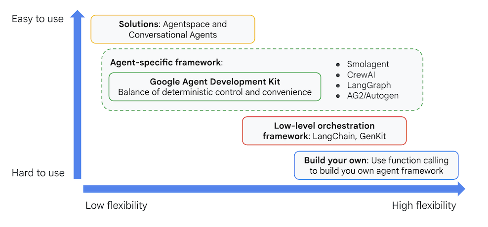

## Overview: Benefits of Agent Development Kit

Agent Development Kit offers several key advantages for developers building agentic applications:

- **Multi-Agent Systems**: Build modular and scalable applications by composing multiple specialized agents in a hierarchy. Enable complex coordination and delegation.
- **Rich Tool Ecosystem**: Equip agents with diverse capabilities: use pre-built tools (Search, Code Execution, etc.), create custom functions, integrate tools from third-party agent frameworks (LangChain, CrewAI), or even use other agents as tools.
- **Flexible Orchestration**: Define workflows using workflow agents (SequentialAgent, ParallelAgent, and LoopAgent) for predictable pipelines, or leverage LLM-driven dynamic routing (LlmAgent transfer) for adaptive behavior.
- **Integrated Developer Experience**: Develop, test, and debug locally with a powerful CLI and an interactive dev UI. Inspect events, state, and agent execution step-by-step.
- **Built-in Evaluation**: Systematically assess agent performance by evaluating both the final response quality and the step-by-step execution trajectory against predefined test cases.
- **Deployment Ready**: Containerize and deploy your agents anywhere – run locally, scale with Vertex AI Agent Engine, or integrate into custom infrastructure using Cloud Run or Docker.

While other Gen AI SDKs or agent frameworks also allow you to query models and even empower them with tools, dynamic coordination between multiple models requires a significant amount of work on your end.

Agent Development Kit offers a higher-level framework than these tools, allowing you to easily connect multiple agents to one another for complex but easy-to-maintain workflows.

Additionally, it allows you to deploy these complex systems of agents to a fully-managed endpoint in Agent Engine, so you can focus on the agents' logic while infrastructure is allocated and scaled for you.

## Core Concepts of Agent Development Kit

Google ADK is built around a few core concepts that make it powerful and flexible:

- **Agent**: Agents are core building blocks designed to accomplish specific tasks. They can be powered by LLMs to reason, plan, and utilize tools to achieve goals, and can even collaborate on complex projects.
- **Tools**: Leveraging tools effectively is what truly distinguishes intelligent agents from basic models. A tool is a block of code, like a function or a method, that executes specific actions such as interacting with databases, making API requests, or invoking other external services. Tools empower agents to interact with other systems and perform actions beyond their core reasoning and generation capabilities. It's crucial to note that these tools operate independently of the agent's LLM, meaning that tools do not automatically possess their own reasoning abilities. Agent Development Kit provides developers with a diverse range of tool options:
  - **Pre-built Tools**: Ready-to-use functionalities such as Google Search, Code Execution, and Retrieval-Augmented Generation (RAG) tools. Available pre-built tools from Google include:
    - **Google Search** (`google_search`): Allows the agent to perform web searches using Google Search. You simply add `google_search` to the agent's tools.
    - **Code Execution** (`built_in_code_execution`): Allows the agent to execute code for calculations, data manipulation, or programmatic system interactions. You can use the pre-built `VertexCodeInterpreter` or any code executor that implements the `BaseCodeExecutor` interface.
    - **Retrieval** (`retrieval`): A package of tools designed to fetch information from various sources.
    - **Vertex AI Search Tool** (`VertexAiSearchTool`): Integrates with Google Cloud's Vertex AI Search service to allow the agent to search through your AI Applications data stores.
  - **Third-Party Tools**: Seamless integration of tools from external libraries like LangChain and CrewAI.
  - **Custom Tools**: The ability to create custom tools tailored to specific requirements, by using language specific constructs and Agents-as-Tools. The SDK also provides asynchronous capabilities through Long Running Function Tools.
- **Session Services**: Session services handle the context of a single conversation (Session), including its history (Events) and the agent's working memory for that conversation (State).
- **Callbacks**: Custom code snippets you provide to run at specific points in the agent's process, allowing for checks, logging, or behavior modifications.
- **Artifact Management**: Artifacts allow agents to save, load, and manage files or binary data (like images or PDFs) associated with a session or user.
- **Runner**: The engine that manages the execution flow, orchestrates agent interactions based on Events, and coordinates with backend services.

Multi-Agent Systems
The Agent Development Kit empowers developers to get more reliable, sophisticated, multi-step behaviors from generative models. Instead of writing long, complex prompts that may not deliver results reliably, you can construct a flow of multiple, simple agents that can collaborate on complex problems by dividing tasks and responsibilities.

This architectural approach offers several key advantages such as:

Easier to design: You can think in terms of agents with specific jobs and skills.
Specialized functions with more reliable performance: Specialized agents can learn from clear examples to become more reliable at their specific tasks.
Organization: Dividing the workflow into distinct agents allows for a more organized, and therefor easier to think about, approach.
Improvability and maintainability: It is easier to improve or fix a specialized component rather than make changes to a complex agent that may fix one behavior but might impact others.
Modularity: Distinct agents from one workflow can be easily copied and included in other similar workflows.

In Agent Development Kit, you organize your agents in a tree-like structure. This helps limit the options for transfers for each agent in the tree, making it easier to control and predict the possible routes the conversation can take through the tree. Benefits of the hierarchical structure include:

It draws inspiration from real-world collaborative teams, making it easier to design and reason about the behavior of the multi-agent system.
It is intuitive for developers, as it mirrors common software development patterns.
It provides greater control over the flow of information and task delegation within the system, making it easier to understand possible pathways and debug the system. For example, if a system has two report-generation agents at different parts of its flow with similar descriptions, the tree structure makes it easier to ensure that the correct one is invoked.
The structure always begins with the agent defined in the root_agent variable (although it may have a different user-facing name to identify itself). The root_agent may act as a parent to one or more sub-agents. Each sub-agent agent may have its own sub-agents.
