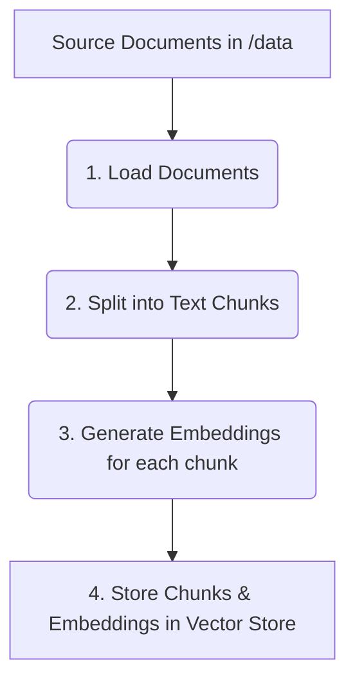
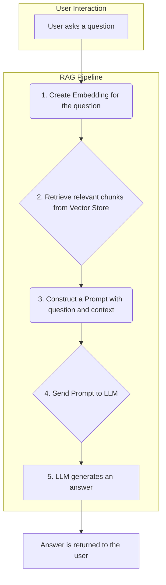

Understanding the RAG Sample Project
This document provides a high-level overview of this Retrieval-Augmented Generation (RAG) project. We'll explore what the key components are, why they exist, and how they work together to answer questions based on custom data.
 
What is RAG?
Retrieval-Augmented Generation (RAG) is a technique for building AI applications that can answer questions about specific information not present in their original training data.

It works by combining two main processes:

Retrieval: When you ask a question, the system first searches a private knowledge base (like your company's documents, PDFs, or website content) to find the most relevant text snippets.
Generation: It then feeds these relevant snippets, along with your original question, to a Large Language Model (LLM) like GPT-4. The LLM uses this provided context to generate a precise and informed answer.
In short, RAG grounds the LLM in facts from your data, reducing hallucinations and enabling it to answer questions about private or recent information.
 
Project Structure: What, Why, and How
A RAG application is typically broken down into two main phases: Data Ingestion (a one-time setup process) and Inference (the real-time Q&A process).
 
Here’s a breakdown of the typical folders and files in this repository and the role they play.
 
1. Data Ingestion Pipeline
This is the offline process where we prepare our knowledge base. It reads your source documents, processes them, and stores them in a way that's efficient for searching.
### Component / Folder | What it is | Why it's needed
|---|---|---|
| `data/` | A directory to store your source documents (e.g., .pdf, .txt, .md). | This is the raw knowledge base the RAG system will learn from. |
| `scripts/ingest.py` | A Python script that orchestrates the entire data ingestion process. | This script automates the steps needed to prepare your data, making the process repeatable and reliable. |
| Document Loader | A module that loads documents from the `data/` directory. | Different file types require different loading logic. This component abstracts that complexity. |
| Text Splitter | A module that breaks large documents into smaller, manageable chunks. | LLMs have a limited context window. Splitting text ensures we can fit the most relevant information into the prompt. It also improves retrieval accuracy. |
| Embedding Model | A machine learning model that converts text chunks into numerical vectors (embeddings). | Computers work with numbers, not text. Embeddings capture the semantic meaning of the text, allowing us to find chunks that are conceptually similar to the user's query. |
| Vector Store | A specialized database (e.g., ChromaDB, FAISS) that stores the embeddings and their corresponding text chunks. | Vector stores are optimized for fast similarity searches. They allow the system to quickly find the most relevant text chunks for a given query vector. |

### How Ingestion Works:



You typically run this process once using a command like:

```bash
python scripts/ingest.py
```

## 2. Inference Pipeline (Q&A)
This is the online process that happens every time a user asks a question. It uses the prepared Vector Store to find context and generate an answer.

### Component / Folder | What it is | Why it's needed
|---|---|---|
| `app/main.py` | The main application entry point, often a web server (e.g., using FastAPI or Flask). | This file exposes the RAG pipeline as an API endpoint (e.g., `/chat`), allowing user interfaces or other services to interact with it. |
| Retriever | A module that takes a user's query, creates an embedding for it, and queries the Vector Store. | This is the core of the "Retrieval" step. Its job is to find the most relevant context chunks from the knowledge base that can help answer the user's question. |
| Prompt Template | A pre-defined text structure that combines the user's query and the retrieved context. | A well-crafted prompt is crucial for guiding the LLM to produce a high-quality answer based only on the provided context. It often includes instructions like "Answer the question based on the following context only." |
| LLM (Generator) | A Large Language Model that receives the formatted prompt and generates the final answer. | This is the "Generation" step. The LLM uses its reasoning capabilities to synthesize an answer from the retrieved context. |

### How Inference Works:



## How to Run the Sample
To get the out-of-the-box sample running, you generally follow these steps:

### Setup Environment:
Install the required Python packages.

```bash
pip install -r requirements.txt
```

### Configure Settings:
Create a `.env` file and add your API keys (e.g., `OPENAI_API_KEY`) and any other necessary configurations. A `.env.example` file is usually provided as a template.

### Add Your Data:
Place your PDF, TXT, or other documents into the `data/` directory.

### Run Data Ingestion:
Process your documents and populate the vector store.

```bash
python scripts/ingest.py
```

### Start the Application:
Launch the web server.

```bash
uvicorn app.main:app --reload
```

### Interact with the API:
You can now send requests to the API (e.g., at `http://127.0.0.1:8000/docs`) to ask questions and get answers.

This markdown file should give you a solid foundation for understanding the repository. Let me know if you'd like to dive deeper into any specific component!