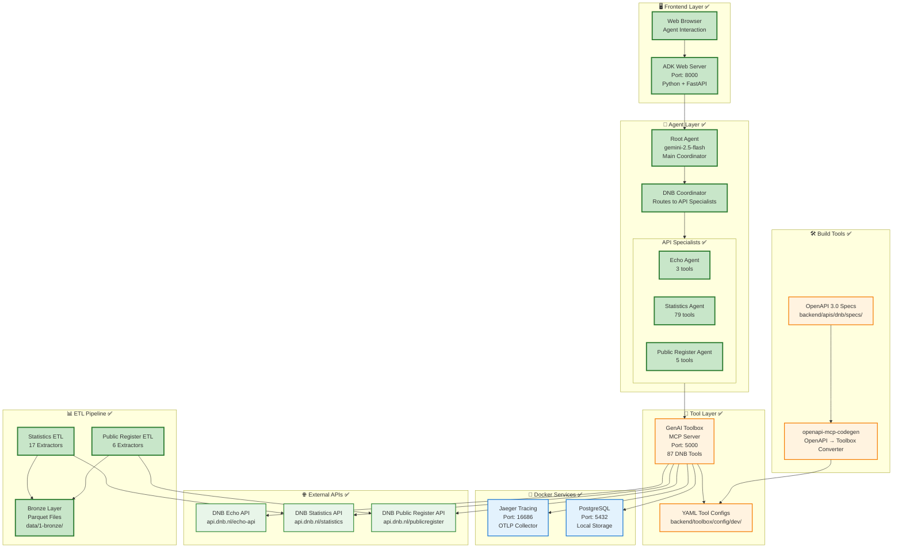
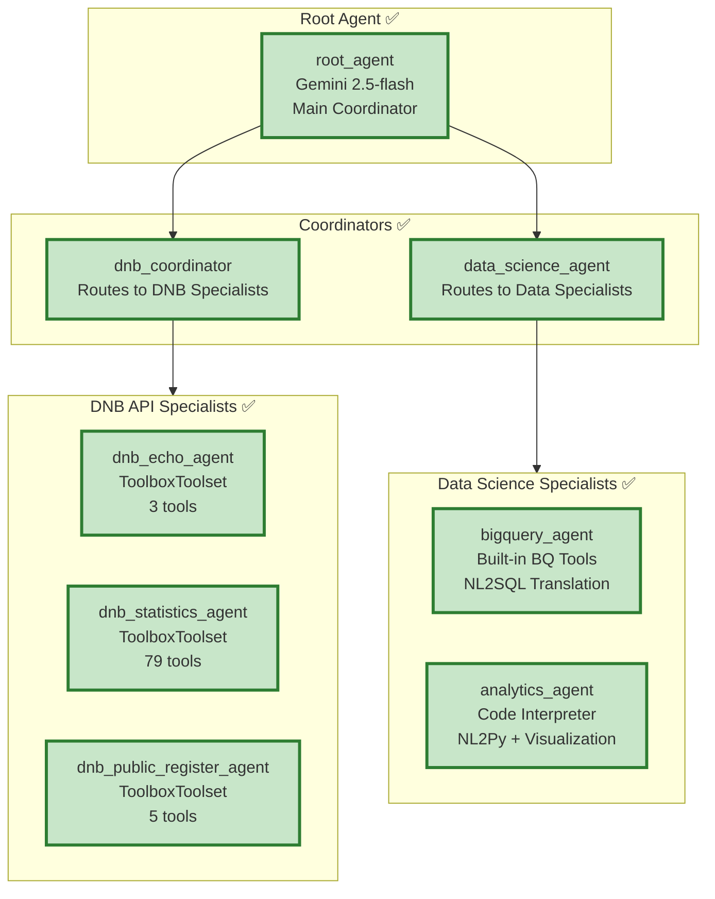
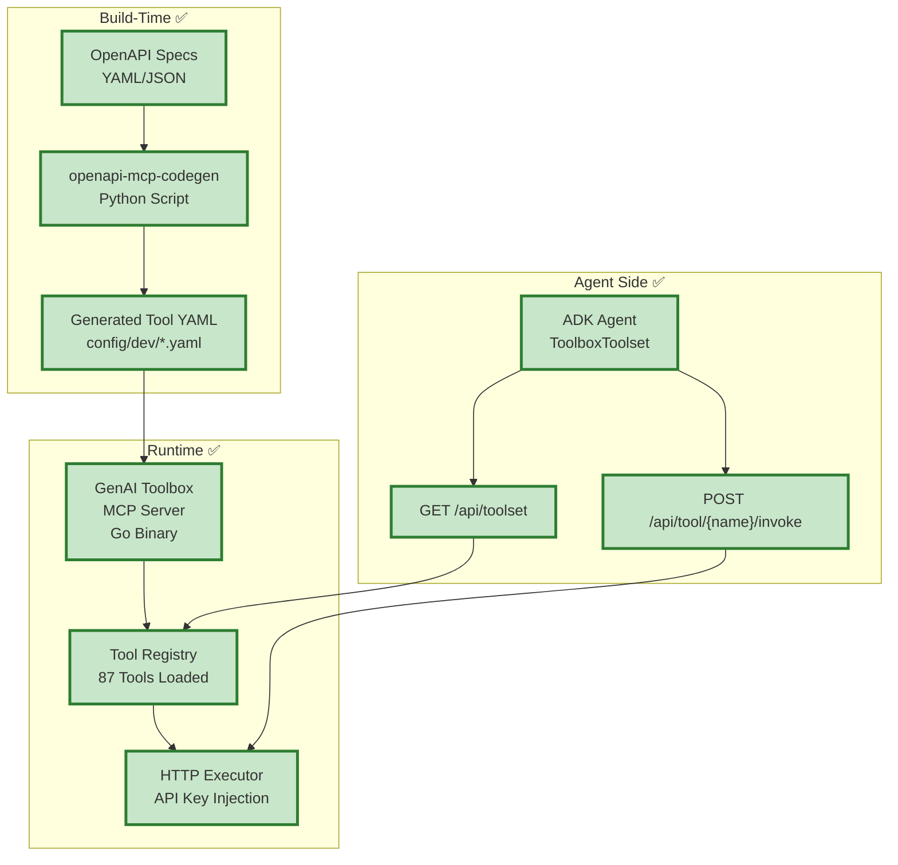
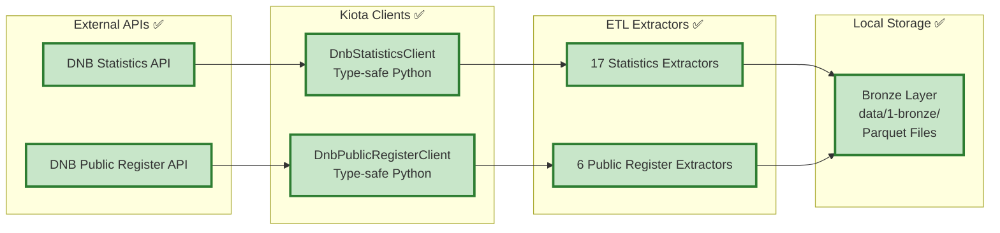
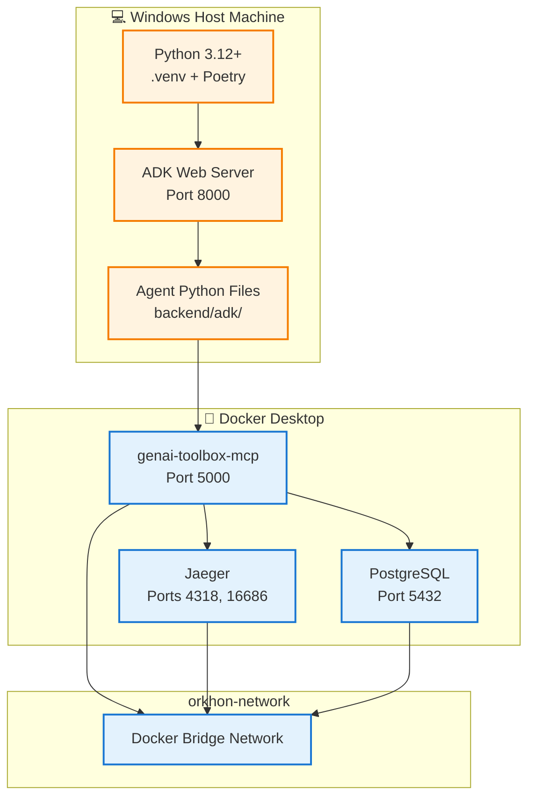

# Orkhon Backend Architecture - Current Implementation

> **Current State Documentation**  
> This document reflects the **actual implemented system** as of October 2025

---

## 📖 Table of Contents

- [System Overview](#system-overview)
- [Implemented Components](#implemented-components)
- [Agent Architecture](#agent-architecture)
- [Tool Integration](#tool-integration)
- [ETL Pipeline](#etl-pipeline)
- [Deployment Architecture](#deployment-architecture)

---

## System Overview

### Current High-Level Architecture ✅



**Current Stack:**
- ✅ **Model**: Google Gemini 2.5-flash (via Vertex AI or API key)
- ✅ **Framework**: Google ADK (Agent Development Kit)
- ✅ **Tools**: GenAI Toolbox (Go-based MCP server)
- ✅ **Observability**: Jaeger + OpenTelemetry
- ✅ **Data**: Local Parquet files (Bronze layer)
- ✅ **Deployment**: Local development (Docker Compose + Python venv)

---

## Implemented Components

### Current Agent Hierarchy ✅



**Implementation Details:**
- **Location**: `backend/adk/agents/`
- **Language**: Python 3.12+
- **Framework**: Google ADK (google.adk)
- **Model**: Gemini 2.5-flash (configurable)
- **Pattern**: Hierarchical delegation with `transfer_to_agent()`

**Agent Types:**
1. **Root Agent**: Entry point and main coordinator
2. **DNB Coordinator**: Routes DNB API requests (Echo, Statistics, Public Register)
3. **Data Science Agent**: Routes data analysis requests (BigQuery, Analytics)
4. **DNB Specialists**: Execute DNB API calls via MCP Toolbox
5. **Data Specialists**: Execute database queries and analytics

---

## Tool Integration

### Current Tool Architecture ✅



**Current Tool Count:**
- **Echo API**: 3 tools ✅
- **Statistics API**: 79 tools ✅
- **Public Register API**: 5 tools ✅
- **Total**: 87 tools ✅

---

## ETL Pipeline

### Current Data Flow ✅



**Current ETL Features:**
- ✅ Type-safe API clients (Kiota-generated)
- ✅ Smart pagination handling
- ✅ Metadata tracking
- ✅ Parquet output format
- ✅ Error recovery with checkpoints

---

## Deployment Architecture

### Current Local Setup ✅



**Startup Command:**
```powershell
.\backend\scripts\quick-start.ps1
```

**What It Does:**
1. ✅ Checks Docker Desktop is running
2. ✅ Creates/verifies orkhon-network
3. ✅ Starts/restarts Docker services (Toolbox, Jaeger, Postgres)
4. ✅ Opens Toolbox UI and Jaeger UI
5. ✅ Activates Python venv
6. ✅ Starts ADK Web server on port 8000

---

## Technology Stack

### Current Technologies ✅

| Component | Technology | Version |
|-----------|-----------|---------|
| **Language** | Python | 3.12+ |
| **Agent Framework** | Google ADK | Latest |
| **LLM** | Gemini | 2.5-flash / 2.0-flash |
| **Tool Server** | GenAI Toolbox | Latest (Go) |
| **Protocol** | MCP | 1.0+ |
| **API Specs** | OpenAPI | 3.0 |
| **Client Generator** | Kiota | Latest |
| **Tracing** | Jaeger | Latest |
| **Observability** | OpenTelemetry | Latest |
| **Data Format** | Parquet | Latest |
| **Package Manager** | Poetry/uv | Latest |
| **Container** | Docker Compose | Latest |

---

## File Structure

### Current Project Layout ✅

```
orkhon/
├── backend/
│   ├── adk/                    # ✅ Agent code
│   │   ├── agents/            # ✅ Root + coordinators + specialists
│   │   ├── simple_dnb_agent.py # ✅ LangGraph example
│   │   └── run_dnb_openapi_agent.py # ✅ Runner
