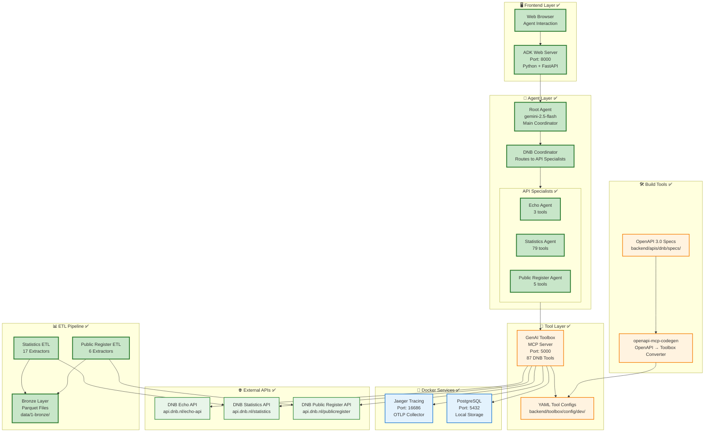
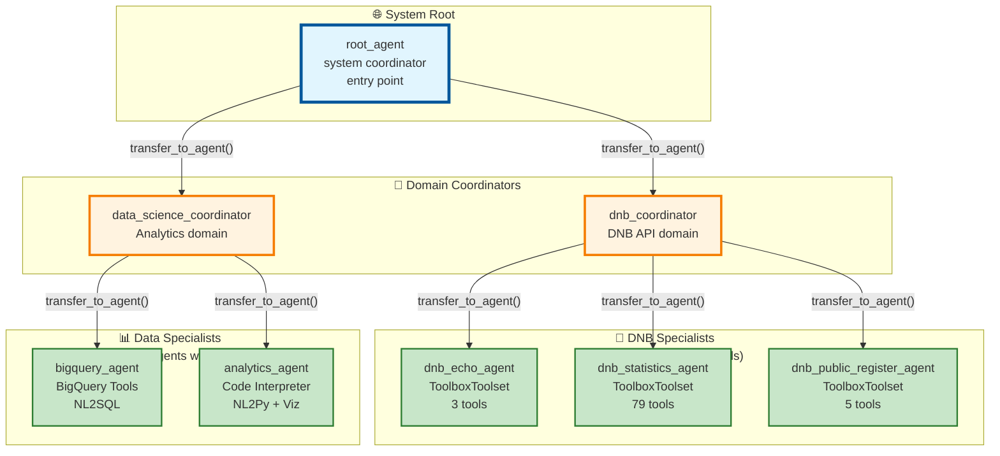

# Orkhon Backend Architecture - Current Implementation

> **Current State Documentation**  
> This document reflects the **actual implemented system** as of October 2025

---

## 📖 Table of Contents

- [System Overview](#system-overview)
- [Implemented Components](#implemented-components)
- [Agent Architecture](#agent-architecture)
- [Tool Integration](#tool-integration)
- [ETL Pipeline](#etl-pipeline)
- [Deployment Architecture](#deployment-architecture)

---

## System Overview

### Current High-Level Architecture ✅

**Current Stack:**
- ✅ **Model**: Google Gemini 2.5-flash (via Vertex AI or API key)
- ✅ **Framework**: Google ADK (Agent Development Kit)
- ✅ **Tools**: GenAI Toolbox (Go-based MCP server)
- ✅ **Observability**: Jaeger + OpenTelemetry
- ✅ **Data**: Local Parquet files (Bronze layer)
- ✅ **Deployment**: Local development (Docker Compose + Python venv)

---

## Implemented Components

### Current Agent Hierarchy ✅

**Agent Hierarchy Explained:**
