# Orkhon Backend Architecture - Current Implementation

> **Current State Documentation**  
> This document reflects the **actual implemented system** as of October 2025

---

## 📖 Table of Contents

- [System Overview](#system-overview)
- [Implemented Components](#implemented-components)
- [Agent Architecture](#agent-architecture)
- [Tool Integration](#tool-integration)
- [ETL Pipeline](#etl-pipeline)
- [Deployment Architecture](#deployment-architecture)

---

## System Overview

### Current High-Level Architecture ✅

```mermaid
graph TB
    subgraph Frontend["🖥️ Frontend Layer ✅"]
        ADK_Web["ADK Web Server<br/>Port: 8000<br/>Python + FastAPI"]
        Browser["Web Browser<br/>Agent Interaction"]
    end

    subgraph Agents["🤖 Agent Layer ✅"]
        Root["Root Agent<br/>gemini-2.5-flash<br/>Main Coordinator"]
        DNB_Coord["DNB Coordinator<br/>Routes to API Specialists"]
        
        subgraph API_Agents["API Specialists ✅"]
            Echo["Echo Agent<br/>3 tools"]
            Stats["Statistics Agent<br/>79 tools"]
            PR["Public Register Agent<br/>5 tools"]
        end
    end

    subgraph Tools["🔧 Tool Layer ✅"]
        Toolbox["GenAI Toolbox<br/>MCP Server<br/>Port: 5000<br/>87 DNB Tools"]
        ToolConfigs["YAML Tool Configs<br/>backend/toolbox/config/dev/"]
    end

    subgraph Docker["🐳 Docker Services ✅"]
        Jaeger["Jaeger Tracing<br/>Port: 16686<br/>OTLP Collector"]
        Postgres["PostgreSQL<br/>Port: 5432<br/>Local Storage"]
    end

    subgraph External["🌐 External APIs ✅"]
        DNB_Echo["DNB Echo API<br/>api.dnb.nl/echo-api"]
        DNB_Stats["DNB Statistics API<br/>api.dnb.nl/statistics"]
        DNB_PR["DNB Public Register API<br/>api.dnb.nl/publicregister"]
    end

    subgraph Build["🛠️ Build Tools ✅"]
        OpenAPIBox["openapi-mcp-codegen<br/>OpenAPI → Toolbox Converter"]
        Specs["OpenAPI 3.0 Specs<br/>backend/apis/dnb/specs/"]
    end

    subgraph ETL["📊 ETL Pipeline ✅"]
        Stats_ETL["Statistics ETL<br/>17 Extractors"]
        PR_ETL["Public Register ETL<br/>6 Extractors"]
        Bronze["Bronze Layer<br/>Parquet Files<br/>data/1-bronze/"]
    end

    %% Current Connections
    Browser --> ADK_Web
    ADK_Web --> Root
    Root --> DNB_Coord
    DNB_Coord --> API_Agents
    API_Agents --> Toolbox
    Toolbox --> ToolConfigs
    Toolbox --> DNB_Echo
    Toolbox --> DNB_Stats
    Toolbox --> DNB_PR
    Toolbox --> Jaeger
    Toolbox --> Postgres
    
    Specs --> OpenAPIBox
    OpenAPIBox --> ToolConfigs
    
    Stats_ETL --> DNB_Stats
    PR_ETL --> DNB_PR
    Stats_ETL --> Bronze
    PR_ETL --> Bronze

    classDef implemented fill:#c8e6c9,stroke:#2e7d32,stroke-width:3px
    classDef tool fill:#fff3e0,stroke:#f57c00,stroke-width:2px
    classDef docker fill:#e3f2fd,stroke:#1976d2,stroke-width:2px
    classDef external fill:#e8f5e9,stroke:#388e3c,stroke-width:2px
    
    class Browser,ADK_Web,Root,DNB_Coord,Echo,Stats,PR,Stats_ETL,PR_ETL,Bronze implemented
    class Toolbox,ToolConfigs,OpenAPIBox,Specs tool
    class Jaeger,Postgres docker
    class DNB_Echo,DNB_Stats,DNB_PR external
```



**Current Stack:**
- ✅ **Model**: Google Gemini 2.5-flash (via Vertex AI or API key)
- ✅ **Framework**: Google ADK (Agent Development Kit)
- ✅ **Tools**: GenAI Toolbox (Go-based MCP server)
- ✅ **Observability**: Jaeger + OpenTelemetry
- ✅ **Data**: Local Parquet files (Bronze layer)
- ✅ **Deployment**: Local development (Docker Compose + Python venv)

---

## Implemented Components

### Current Agent Hierarchy ✅


**Implementation Details:**
- **Location**: `backend/adk/agents/`
- **Language**: Python 3.12+
- **Framework**: Google ADK (google.adk)
- **Model**: Gemini 2.5-flash (configurable)
- **Pattern**: Hierarchical delegation with `transfer_to_agent()`

**Agent Types:**
1. **Root Agent**: Entry point and main coordinator
2. **DNB Coordinator**: Routes DNB API requests (Echo, Statistics, Public Register)
3. **Data Science Agent**: Routes data analysis requests (BigQuery, Analytics)
4. **DNB Specialists**: Execute DNB API calls via MCP Toolbox
5. **Data Specialists**: Execute database queries and analytics

---

## Tool Integration

### Current Tool Architecture ✅


**Current Tool Count:**
- **Echo API**: 3 tools ✅
- **Statistics API**: 79 tools ✅
- **Public Register API**: 5 tools ✅
- **Total**: 87 tools ✅

---

## ETL Pipeline

### Current Data Flow ✅

```mermaid
graph LR
    subgraph APIs["External APIs ✅"]
        DNB_Stats["DNB Statistics API"]
        DNB_PR["DNB Public Register API"]
    end

    subgraph Clients["Kiota Clients ✅"]
        Stats_Client["DnbStatisticsClient<br/>Type-safe Python"]
        PR_Client["DnbPublicRegisterClient<br/>Type-safe Python"]
    end

    subgraph ETL["ETL Extractors ✅"]
        Stats_ETL["17 Statistics Extractors"]
        PR_ETL["6 Public Register Extractors"]
    end

    subgraph Storage["Local Storage ✅"]
        Bronze["Bronze Layer<br/>data/1-bronze/<br/>Parquet Files"]
    end

    DNB_Stats --> Stats_Client
    DNB_PR --> PR_Client
    Stats_Client --> Stats_ETL
    PR_Client --> PR_ETL
    Stats_ETL --> Bronze
    PR_ETL --> Bronze

    classDef implemented fill:#c8e6c9,stroke:#2e7d32,stroke-width:3px
    class DNB_Stats,DNB_PR,Stats_Client,PR_Client,Stats_ETL,PR_ETL,Bronze implemented
```



**Current ETL Features:**
- ✅ Type-safe API clients (Kiota-generated)
- ✅ Smart pagination handling
- ✅ Metadata tracking
- ✅ Parquet output format
- ✅ Error recovery with checkpoints

---

## Deployment Architecture

### Current Local Setup ✅


**Startup Command:**
```powershell
.\backend\scripts\quick-start.ps1
```

**What It Does:**
1. ✅ Checks Docker Desktop is running
2. ✅ Creates/verifies orkhon-network
3. ✅ Starts/restarts Docker services (Toolbox, Jaeger, Postgres)
4. ✅ Opens Toolbox UI and Jaeger UI
5. ✅ Activates Python venv
6. ✅ Starts ADK Web server on port 8000

---

## Technology Stack

### Current Technologies ✅

| Component | Technology | Version |
|-----------|-----------|---------|
| **Language** | Python | 3.12+ |
| **Agent Framework** | Google ADK | Latest |
| **LLM** | Gemini | 2.5-flash / 2.0-flash |
| **Tool Server** | GenAI Toolbox | Latest (Go) |
| **Protocol** | MCP | 1.0+ |
| **API Specs** | OpenAPI | 3.0 |
| **Client Generator** | Kiota | Latest |
| **Tracing** | Jaeger | Latest |
| **Observability** | OpenTelemetry | Latest |
| **Data Format** | Parquet | Latest |
| **Package Manager** | Poetry/uv | Latest |
| **Container** | Docker Compose | Latest |

---

## File Structure

### Current Project Layout ✅

```
orkhon/
├── backend/
│   ├── adk/                    # ✅ Agent code
│   │   ├── agents/            # ✅ Root + coordinators + specialists
│   │   ├── simple_dnb_agent.py # ✅ LangGraph example
│   │   └── run_dnb_openapi_agent.py # ✅ Runner
