# Orkhon Backend Architecture - DNB IT Implementation (Planned)

> Future State: Planned deployment within DNB IT using Azure AI Foundry and Copilot  
> Document Suite:
> - Full Architecture (this document)
> - Quick Reference
> - Visual Summary
> - Executive Presentation

## Table of Contents

- [Vision Overview](#vision-overview)
- [DNB IT Stack](#dnb-it-stack)
- [Microsoft AI Foundry Deep Dive](#microsoft-ai-foundry-deep-dive)
- [Multi-Agent Orchestration Architecture](#multi-agent-orchestration-architecture)
- [Framework Migration Strategy](#framework-migration-strategy)
- [Azure AI Foundry Integration](#azure-ai-foundry-integration)
- [Internal Service Integration](#internal-service-integration)
- [Security & Compliance Architecture](#security--compliance-architecture)
- [A2A Protocol Implementation](#a2a-protocol-implementation)
- [Data Science Platform](#data-science-platform)
- [Deployment Architecture](#deployment-architecture)
- [Technical Decision Matrix](#technical-decision-matrix)
- [Comparison: Current vs Future](#comparison-current-vs-future)
- [Migration Path](#migration-path)
- [Summary](#summary)

## Vision Overview

### Future DNB IT Architecture

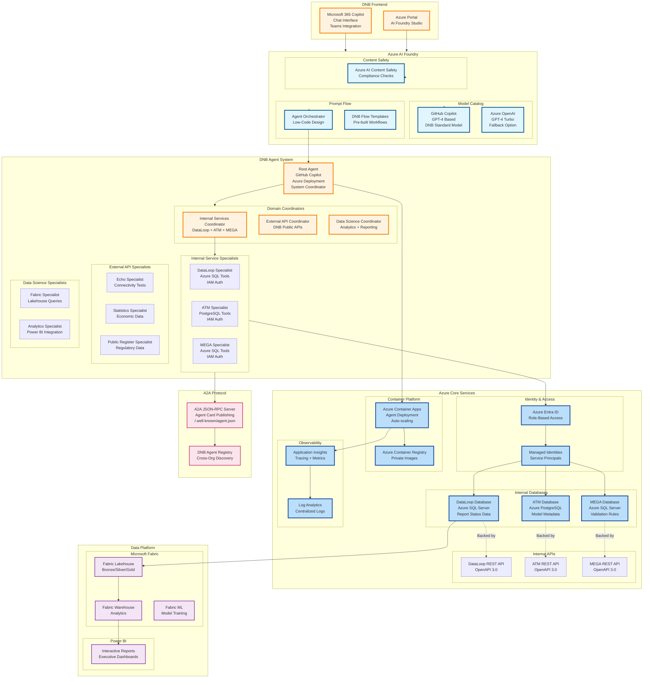

## DNB IT Stack

### Required Microsoft Technologies

| Component | Microsoft Technology | Purpose |
|-----------|---------------------|---------|
| **Model** | GitHub Copilot / Azure OpenAI | DNB standard AI model |
| **Orchestration** | Azure AI Foundry Prompt Flow | Low-code agent design |
| **IDE** | Visual Studio Code + Copilot | Development environment |
| **Identity** | Azure Entra ID | Authentication & authorization |
| **Compute** | Azure Container Apps | Serverless container hosting |
| **Databases** | Azure SQL + PostgreSQL | Internal data sources |
| **Data Warehouse** | Azure Synapse Analytics (Dedicated SQL Pools) | XBRL Verrijkt (enriched) and other enterprise warehouses |
| **Observability** | Application Insights | Distributed tracing |
| **Data Platform** | Microsoft Fabric | Lakehouse + Warehouse |
| **Reporting** | Power BI | Executive dashboards |
| **Registry** | Azure Container Registry | Private container images |
| **Protocol** | Agent-to-Agent (A2A) | Cross-org communication |

## Microsoft AI Foundry Deep Dive

### Overview
Azure AI Foundry is the enterprise platform for model access, orchestration
(Prompt Flow), evaluation, and governed deployment.

### Drivers for Selection
- Compliance: EU residency, audit logging, integrated identity.
- Microsoft 365 (M365) Integration: Teams, Copilot Studio, SharePoint, Outlook.
- Low-Code Acceleration: Prompt Flow templates and connectors.
- Operational Foundations: Auto-scaling, high availability (HA), cost telemetry.

### Components

```mermaid
graph TB
    subgraph Foundry_Platform["Azure AI Foundry Platform"]
        direction TB
        
        subgraph Development["Development Environment"]
            AI_Studio["AI Foundry Studio<br/>Web-based IDE"]
            VS_Code["VS Code Extension<br/>Local Development"]
            Notebooks["Jupyter Notebooks<br/>Experimentation"]
        end
        
        subgraph Models["Model Management"]
            Model_Catalog["Model Catalog<br/>• Azure OpenAI (GPT-4, Copilot)<br/>• Open Source (Llama, Mistral)<br/>• Custom Fine-tuned"]
            Model_Registry["Model Registry<br/>Version Control<br/>A/B Testing"]
        end
        
        subgraph Orchestration["Orchestration Layer"]
            Prompt_Flow["Prompt Flow<br/>Visual Agent Designer"]
            Semantic_Kernel["Semantic Kernel<br/>Code-First Option"]
            LangChain["LangChain Integration<br/>Framework Bridge"]
        end
        
        subgraph Evaluation["Evaluation & Safety"]
            Eval_Suite["Evaluation Suite<br/>• Groundedness<br/>• Relevance<br/>• Coherence"]
            Safety_System["Content Safety<br/>• Jailbreak Detection<br/>• PII Filtering<br/>• Hate Speech"]
        end
        
        subgraph Deployment["Deployment Targets"]
            ACA_Deploy["Azure Container Apps<br/>Production Agents"]
            Functions_Deploy["Azure Functions<br/>Serverless Agents"]
            K8s_Deploy["Azure Kubernetes Service<br/>Complex Orchestration"]
        end
        
        subgraph Data_Integration["Data & Tools"]
            AI_Search["Azure AI Search<br/>Vector Database<br/>RAG Support"]
            Cosmos_DB["Cosmos DB<br/>Session State<br/>Memory Store"]
            Connectors["Built-in Connectors<br/>• Azure Services (300+)<br/>• REST APIs<br/>• Databases"]
        end
    end
    
    AI_Studio --> Prompt_Flow
    VS_Code --> Semantic_Kernel
    Notebooks --> Model_Catalog
    
    Prompt_Flow --> Model_Registry
    Semantic_Kernel --> Model_Registry
    
    Prompt_Flow --> Eval_Suite
    Prompt_Flow --> Safety_System
    
    Prompt_Flow --> ACA_Deploy
    Semantic_Kernel --> Functions_Deploy
    LangChain --> K8s_Deploy
    
    Prompt_Flow --> AI_Search
    Prompt_Flow --> Cosmos_DB
    Prompt_Flow --> Connectors

    classDef dev fill:#e3f2fd,stroke:#1565c0,stroke-width:2px
    classDef models fill:#f3e5f5,stroke:#6a1b9a,stroke-width:2px
    classDef orchestration fill:#fff3e0,stroke:#e65100,stroke-width:2px
    classDef safety fill:#ffebee,stroke:#c62828,stroke-width:2px
    classDef deploy fill:#e8f5e9,stroke:#2e7d32,stroke-width:2px
    classDef data fill:#fce4ec,stroke:#880e4f,stroke-width:2px
    
    class AI_Studio,VS_Code,Notebooks dev
    class Model_Catalog,Model_Registry models
    class Prompt_Flow,Semantic_Kernel,LangChain orchestration
    class Eval_Suite,Safety_System safety
    class ACA_Deploy,Functions_Deploy,K8s_Deploy deploy
    class AI_Search,Cosmos_DB,Connectors data
```

### Prompt Flow vs Code-First Development

Azure AI Foundry supports **two development paradigms**:

#### **Option 1: Prompt Flow (Visual/Low-Code)** - Recommended for DNB

**Characteristics:**
- Drag-and-drop visual canvas for building agent workflows
- Pre-built nodes for LLM calls, tool invocations, conditional logic, loops
- Built-in debugging with step-through execution
- Automatic versioning and deployment to Azure
- Business analysts can contribute to agent development

**Best For:**
- Standard CRUD operations against internal databases
- API orchestration workflows (call API A → transform → call API B)
- Decision trees and approval workflows
- Report generation and data exports

**Example Use Cases at DNB:**
- "Get all pending reports for financial institution X"
- "Route supervisory questions to correct internal database"
- "Generate quarterly compliance summary from multiple sources"

#### **Option 2: Semantic Kernel (Code-First)** - For Complex Logic

**Characteristics:**
- .NET or Python SDK for programmatic agent development
- Full control over orchestration logic, error handling, retries
- Integration with existing codebases and libraries
- Requires software engineering skills
- Better for complex algorithms and custom business logic

**Best For:**
- Complex data transformations and calculations
- Custom authentication flows
- Integration with legacy systems
- Performance-critical scenarios

**Example Use Cases at DNB:**
- Advanced risk calculations with custom formulas
- Multi-step validation workflows with rollback logic
- Real-time fraud detection algorithms

### DNB Architectural Choice: Hybrid Approach

**Recommended Strategy:**

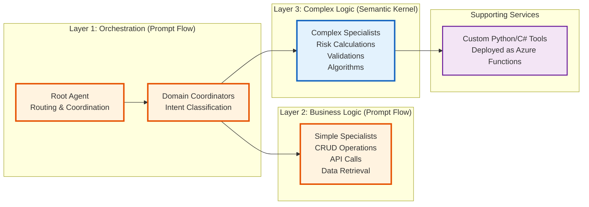

**Benefits of Hybrid Approach:**
- ✅ **80% of agents** use Prompt Flow (fast development, easy maintenance)
- ✅ **20% of agents** use Semantic Kernel (complex logic, performance-critical)
- ✅ **Custom tools** as Azure Functions (reusable across both approaches)
- ✅ **Business analysts** contribute to Prompt Flow agents
- ✅ **Developers** focus on complex Semantic Kernel agents

## Multi-Agent Orchestration Architecture

### DNB Multi-Agent System Overview

The DNB multi-agent system is designed as a **hierarchical orchestration pattern** with three distinct layers:

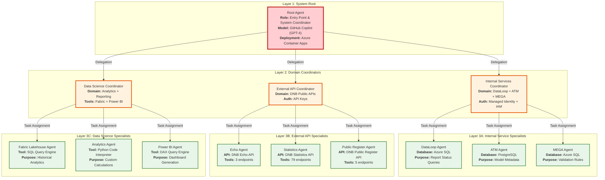

### Agent Communication Patterns

#### Pattern 1: Sequential Delegation (Most Common)

**Use Case**: User query requires data from a single domain

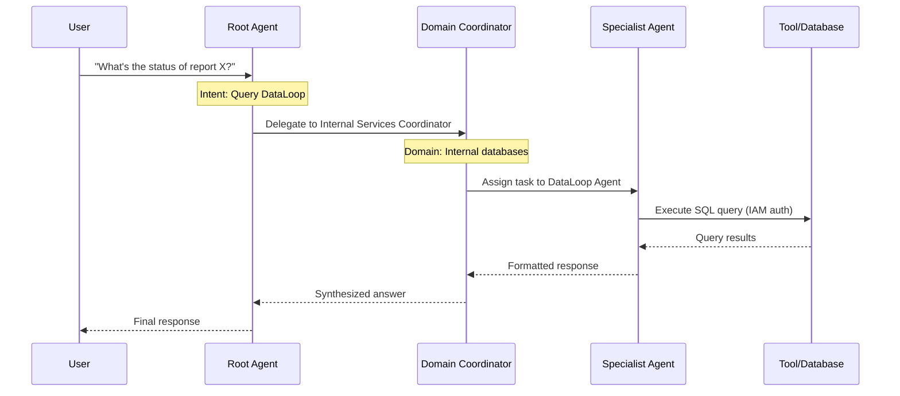

**Key Characteristics:**
- ✅ Root agent identifies domain (internal vs external vs data science)
- ✅ Coordinator agent identifies specific specialist (DataLoop vs ATM vs MEGA)
- ✅ Specialist agent executes tool calls (SQL queries, API calls)
- ✅ Response flows back up the hierarchy
- ✅ Each layer adds context and formatting

#### Pattern 2: Parallel Fan-Out (Multi-Source Queries)

**Use Case**: User query requires data from multiple domains

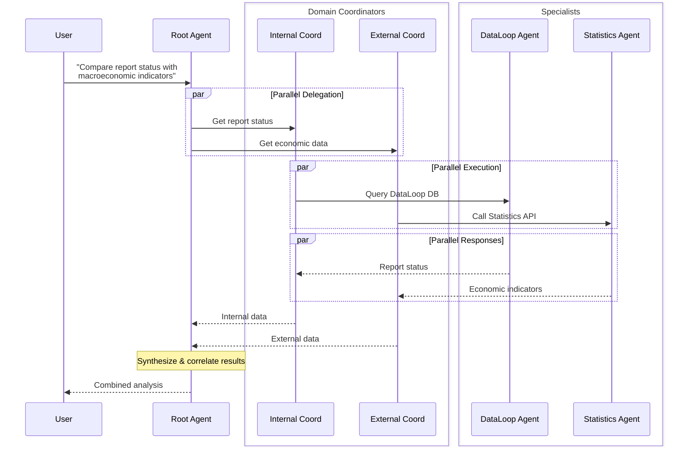

**Key Characteristics:**
- ✅ Root agent spawns multiple parallel tasks
- ✅ Each coordinator works independently
- ✅ Root agent waits for all responses (timeout: 60s)
- ✅ Root agent correlates and synthesizes final answer
- ✅ Handles partial failures gracefully

#### Pattern 3: A2A Cross-Organization (Future State)

**Use Case**: Agent-to-agent communication across DNB departments

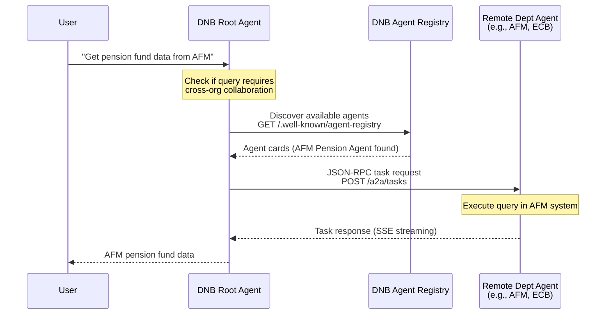

**Key Characteristics:**
- ✅ Agents publish "agent cards" describing capabilities
- ✅ Central registry for agent discovery
- ✅ JSON-RPC 2.0 protocol for task management
- ✅ Server-Sent Events (SSE) for real-time updates
- ✅ OAuth 2.0 / Azure Entra ID for cross-org auth

### Agent State Management

**Challenge**: Maintaining conversation context across multiple agents in a hierarchy

**Solution**: Azure Cosmos DB as shared session store

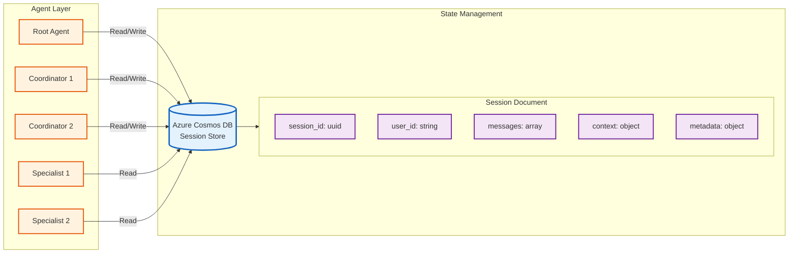

**Session Document Structure**:
```json
{
  "session_id": "550e8400-e29b-41d4-a716-446655440000",
  "user_id": "user@dnb.nl",
  "created_at": "2025-11-03T10:00:00Z",
  "updated_at": "2025-11-03T10:05:23Z",
  "messages": [
    {
      "role": "user",
      "content": "What's the status of report X?",
      "timestamp": "2025-11-03T10:00:00Z"
    },
    {
      "role": "root_agent",
      "content": "Delegating to Internal Services Coordinator",
      "timestamp": "2025-11-03T10:00:02Z"
    },
    {
      "role": "dataloop_agent",
      "content": "Query results: Report X status = APPROVED",
      "timestamp": "2025-11-03T10:00:05Z"
    }
  ],
  "context": {
    "current_agent": "root_agent",
    "delegation_chain": ["root_agent", "internal_coordinator", "dataloop_agent"],
    "active_domain": "internal_services"
  },
  "metadata": {
    "total_agents_invoked": 3,
    "total_tool_calls": 1,
    "total_tokens": 450
  }
}
```

**Key Benefits:**
- ✅ All agents share conversation history
- ✅ Coordinators understand previous delegation decisions
- ✅ Specialists see full user intent (not just coordinator instructions)
- ✅ Root agent tracks entire conversation flow for synthesis
- ✅ Cosmos DB provides global distribution and low latency

## Framework Migration Strategy

### From Google ADK to Azure AI Foundry

DNB's current prototype uses **Google ADK (Agent Development Kit)**, but production deployment must use **Azure AI Foundry**. This section explains the migration path.

### Architecture Mapping: ADK → Azure AI Foundry

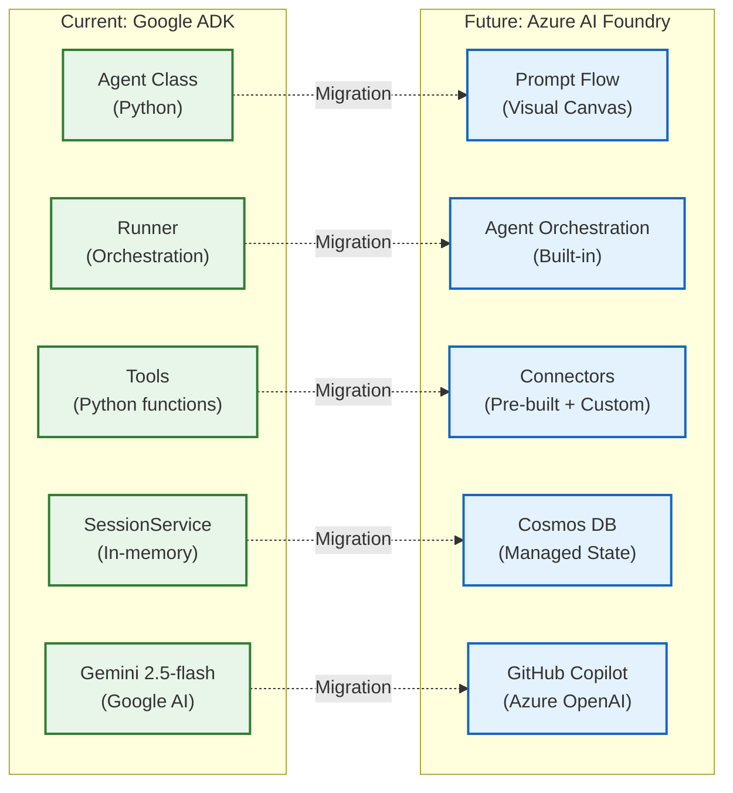

### Component-by-Component Migration Guide

#### 1. **Agent Definitions** (ADK → Prompt Flow)

**Current ADK Code (Python):**
```python
from google.adk import Agent

dnb_statistics_agent = Agent(
    name="dnb_statistics_agent",
    model="gemini-2.5-flash",
    instruction="You are a specialist for DNB Statistics API.",
    tools=[toolbox_toolset.from_server("dnb_statistics_tools")]
)
```

**Future Prompt Flow (Visual Config):**
```yaml
# dnb_statistics_agent.yaml
agent:
  name: dnb_statistics_agent
  type: prompt_flow
  model:
    provider: azure_openai
    deployment: copilot-gpt4
    temperature: 0.2
  system_prompt: |
    You are a specialist for DNB Statistics API.
    Use the provided tools to query economic data.
  tools:
    - type: connector
      name: dnb_statistics_connector
      connection: dnb_statistics_api_connection
  deployment:
    target: azure_container_apps
    environment: dnb-production
```

**Migration Steps:**
1. Export ADK agent configuration as YAML
2. Import into Prompt Flow visual canvas
3. Configure model (Copilot instead of Gemini)
4. Map tools to Azure connectors
5. Test in AI Foundry Studio
6. Deploy to Container Apps

#### 2. **Tool Functions** (Python → Azure Functions)

**Current ADK Tool (Python):**
```python
@tool
def get_report_status(fi_id: str, report_type: str) -> dict:
    """Get current status of a regulatory report."""
    conn = get_db_connection()  # Local connection
    result = conn.execute(
        "SELECT status FROM reports WHERE fi_id = ? AND type = ?",
        (fi_id, report_type)
    )
    return {"status": result[0]}
```

**Future Azure Function (Python + Managed Identity):**
```python
import azure.functions as func
from azure.identity import ManagedIdentityCredential
from azure.storage.blob import BlobServiceClient

def main(req: func.HttpRequest) -> func.HttpResponse:
    """Get report status (Azure Function with Managed Identity)."""
    # Authenticate using Managed Identity (no keys needed)
    credential = ManagedIdentityCredential()
    
    # Connect to Azure SQL using IAM
    connection_string = get_connection_string(credential)
    conn = pymssql.connect(connection_string)
    
    # Execute query
    fi_id = req.params.get('fi_id')
    report_type = req.params.get('report_type')
    result = conn.execute(
        "SELECT status FROM reports WHERE fi_id = ? AND type = ?",
        (fi_id, report_type)
    )
    
    return func.HttpResponse(json.dumps({"status": result[0]}))
```

**Prompt Flow Integration:**
```yaml
# In Prompt Flow canvas
- node: get_report_status
  type: azure_function
  connection: dnb-function-app
  function_name: get_report_status
  inputs:
    fi_id: ${inputs.financial_institution_id}
    report_type: ${inputs.report_type}
  outputs:
    status: ${get_report_status.status}
```

#### 3. **Session Management** (In-Memory → Cosmos DB)

**Current ADK (In-Memory):**
```python
from google.adk.sessions import InMemorySessionService

session_service = InMemorySessionService()
session = session_service.create_session(user_id="user@dnb.nl")
```

**Future Azure AI Foundry (Cosmos DB):**
```python
from azure.cosmos import CosmosClient
from azure.identity import ManagedIdentityCredential

# Authenticate with Managed Identity
credential = ManagedIdentityCredential()
client = CosmosClient(
    url="https://dnb-agents.documents.azure.com:443/",
    credential=credential
)

database = client.get_database_client("dnb_agents")
container = database.get_container_client("sessions")

# Create session
session_doc = {
    "session_id": str(uuid.uuid4()),
    "user_id": "user@dnb.nl",
    "messages": [],
    "created_at": datetime.utcnow().isoformat()
}
container.create_item(session_doc)
```

**Prompt Flow Auto-Configuration:**
- Prompt Flow automatically manages session state in Cosmos DB
- No manual code required for most scenarios
- Specify Cosmos DB connection in Prompt Flow settings

#### 4. **Multi-Agent Orchestration** (ADK Runner → Prompt Flow Router)

**Current ADK (Python Code):**
```python
from google.adk import Agent, Runner

root_agent = Agent(
    name="root_agent",
    sub_agents=[dnb_coordinator, data_science_coordinator]
)

runner = Runner()
response = runner.run(agent=root_agent, user_message="Get report status")
```

**Future Prompt Flow (Visual Routing):**
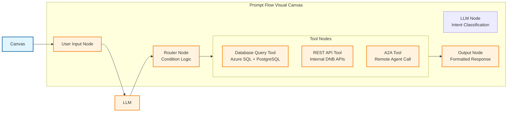

**Prompt Flow Configuration:**
```yaml
# root_agent_flow.yaml
nodes:
  - name: user_input
    type: input
    
  - name: intent_classifier
    type: llm
    model: copilot-gpt4
    prompt: |
      Classify user intent into: internal_query, api_query, analytics_query
      User query: ${user_input.message}
    output: ${intent}
    
  - name: router
    type: router
    conditions:
      - condition: ${intent} == "internal_query"
        next: call_internal_coordinator
      - condition: ${intent} == "api_query"
        next: call_external_coordinator
      - condition: ${intent} == "analytics_query"
        next: call_data_coordinator
    
  - name: call_internal_coordinator
    type: agent
    agent: internal_services_coordinator
    input: ${user_input.message}
    
  - name: merge_results
    type: python
    code: |
      # Combine results from all coordinators
      results = [r for r in [internal_result, external_result, data_result] if r]
      return {"combined": results}
```

## Security & Compliance Architecture

### DNB Security Requirements

As a financial regulatory authority, DNB has stringent security requirements that must be met:

#### 1. **Identity & Access Management (IAM)**

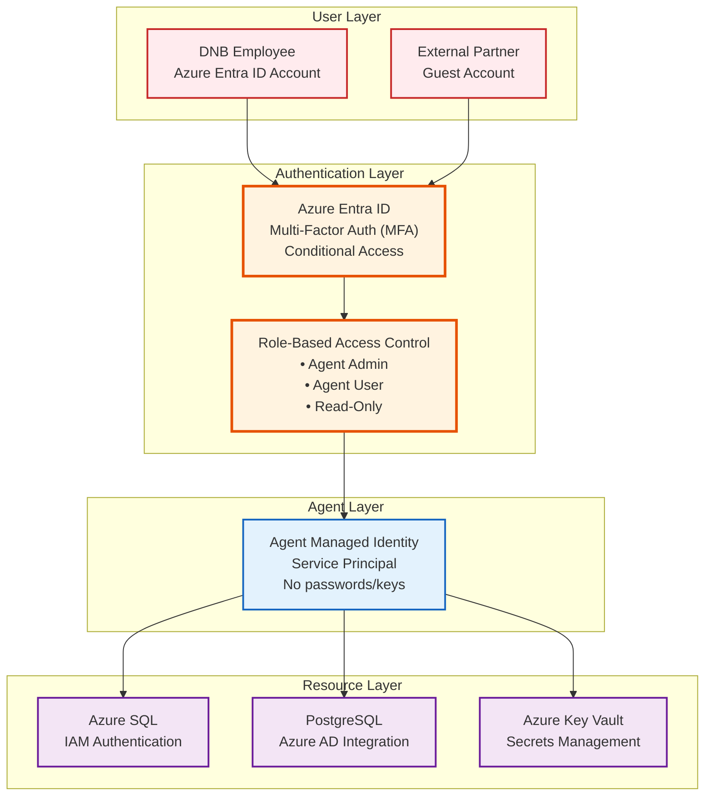

**Key Security Principles:**
- ✅ **Zero Trust**: Every request authenticated and authorized
- ✅ **Least Privilege**: Agents only access resources they need
- ✅ **No Secrets in Code**: All credentials in Key Vault or Managed Identity
- ✅ **Audit Trails**: All access logged to Log Analytics

#### 2. **Data Protection & Privacy**

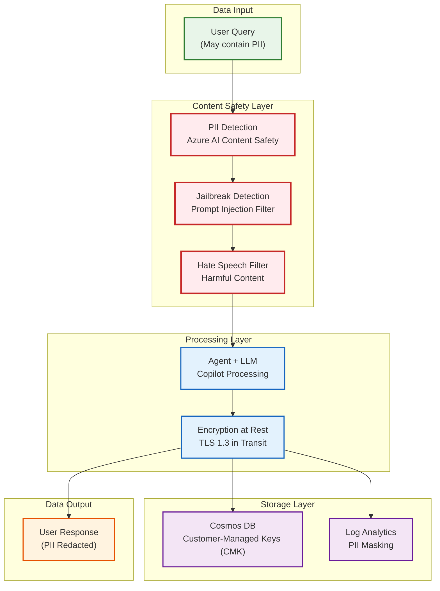

**Data Protection Measures:**
- ✅ **PII Detection**: Automatic detection and masking of personal data
- ✅ **Encryption**: AES-256 at rest, TLS 1.3 in transit
- ✅ **Customer-Managed Keys**: DNB controls encryption keys
- ✅ **Data Residency**: All data stays in EU-West region
- ✅ **Retention Policies**: Automatic data deletion after 90 days

#### 3. **Audit & Compliance**

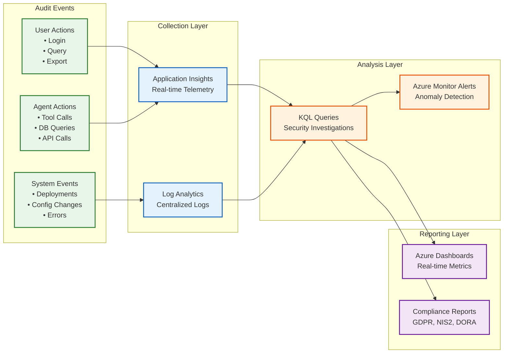

**Audit Capabilities:**
- ✅ **Complete Tracing**: Every request traced end-to-end
- ✅ **Immutable Logs**: Logs cannot be deleted or modified
- ✅ **Real-time Alerts**: Suspicious activity triggers alerts
- ✅ **Compliance Reports**: Automated GDPR/NIS2/DORA reporting

## Azure AI Foundry Integration

### Prompt Flow Agent Design

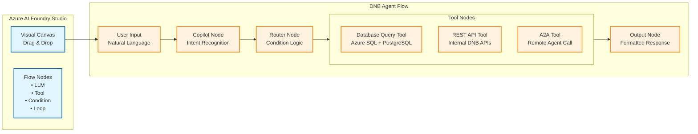

## Internal Service Integration

**Key Requirements:**
- Azure Entra ID (formerly Azure Active Directory) for authentication
- Managed Identities for service-to-service auth
- Role-Based Access Control (RBAC) for database permissions
- Token refresh and caching
- Connection pooling for performance
...existing code...

## A2A Protocol Implementation
- JSON-RPC 2.0 (JavaScript Object Notation Remote Procedure Call) for task
  management; Server-Sent Events (SSE) for real-time updates.
...existing code...

## Data Science Platform
...existing code...

### Microsoft Fabric Integration
...existing code...

### Synapse Data Warehouses (Azure Synapse Analytics)
- XBRL Verrijkt (enriched) warehouse hosted on Azure Synapse Analytics
  Dedicated SQL pools; primary store for enriched XBRL filings.
- Access patterns:
  - Data Engineering Agent: Conversational T‑SQL and Spark for joins,
    compaction, and lineage-aware transformations.
  - Data Analytics Agent: Aggregations and slice‑and‑dice over curated schemas
    with citation and audit notes.
- Connectivity: Private endpoints, Managed Identity, Azure Entra ID RBAC.
- Coexistence with Microsoft Fabric: Fabric remains the enterprise data
  platform; Synapse serves existing warehouses and high-throughput SQL workloads.
...existing code...

## Deployment Architecture
...existing code...

## Technical Decision Matrix
...existing code...

#### 5. **Data Platform: Microsoft Fabric vs Databricks vs Synapse**
...existing code...

**Decision**: Microsoft Fabric (primary) + Azure Synapse Analytics (for existing
enterprise warehouses such as XBRL Verrijkt)

**Rationale**:
- Fabric is the enterprise standard for analytics and BI (business intelligence).
- Synapse supports existing dedicated SQL pools and high-throughput SQL needs.
- Agents converse with Synapse using governed T‑SQL/Spark while Fabric powers BI.
...existing code...

## Comparison: Current vs Future
...existing code...

## Migration Path
...existing code...

### From Current to Future
...existing code...
- Phase 3: Connect Azure Synapse Analytics (XBRL Verrijkt dedicated SQL pool)
  and configure Managed Identity + private endpoints.
...existing code...

## Summary
...existing code...
- Synapse integration: XBRL Verrijkt warehouse exposed to Data Engineering and
  Data Analytics agents through governed T‑SQL/Spark endpoints with RBAC and
  audit.
...existing code...
