# Orkhon Backend Architecture - DNB IT Implementation (Planned)

> **Future State Documentation**  
> This document describes the **planned deployment** within DNB IT infrastructure with Microsoft Azure AI Foundry and Copilot
>
> **📚 Document Suite**:
> - **Full Architecture** (this document) - Comprehensive technical details (1,579 lines)
> - [Quick Reference](./DNB_ARCHITECTURE_QUICK_REFERENCE.md) - One-page summary
> - [Visual Summary](./DNB_ARCHITECTURE_VISUAL_SUMMARY.md) - Diagrams and flowcharts
> - [Executive Presentation](./DNB_ARCHITECTURE_EXECUTIVE_SUMMARY.md) - Business case for leadership

---

## 📖 Table of Contents

- [Vision Overview](#vision-overview)
- [DNB IT Stack](#dnb-it-stack)
- [Microsoft AI Foundry Deep Dive](#microsoft-ai-foundry-deep-dive)
- [Multi-Agent Orchestration Architecture](#multi-agent-orchestration-architecture)
- [Framework Migration Strategy](#framework-migration-strategy)
- [Azure AI Foundry Integration](#azure-ai-foundry-integration)
- [Internal Service Integration](#internal-service-integration)
- [Security & Compliance Architecture](#security--compliance-architecture)
- [A2A Protocol Implementation](#a2a-protocol-implementation)
- [Data Science Platform](#data-science-platform)
- [Deployment Architecture](#deployment-architecture)
- [Technical Decision Matrix](#technical-decision-matrix)
- [Comparison: Current vs Future](#comparison-current-vs-future)
- [Migration Path](#migration-path)
- [Summary](#summary)

---

## Vision Overview

### Future DNB IT Architecture 📋


---

## DNB IT Stack

### Required Microsoft Technologies 📋

| Component | Microsoft Technology | Purpose |
|-----------|---------------------|---------|
| **Model** | GitHub Copilot / Azure OpenAI | DNB standard AI model |
| **Orchestration** | Azure AI Foundry Prompt Flow | Low-code agent design |
| **IDE** | Visual Studio Code + Copilot | Development environment |
| **Identity** | Azure Entra ID | Authentication & authorization |
| **Compute** | Azure Container Apps | Serverless container hosting |
| **Databases** | Azure SQL + PostgreSQL | Internal data sources |
| **Observability** | Application Insights | Distributed tracing |
| **Data Platform** | Microsoft Fabric | Lakehouse + Warehouse |
| **Reporting** | Power BI | Executive dashboards |
| **Registry** | Azure Container Registry | Private container images |
| **Protocol** | A2A (Agent-to-Agent) | Cross-org communication |

---

## Microsoft AI Foundry Deep Dive

### What is Azure AI Foundry? 📋

**Azure AI Foundry** (formerly Azure AI Studio) is Microsoft's comprehensive platform for building, evaluating, and deploying enterprise AI applications. It provides a unified development experience that combines:

- **Model Catalog**: Access to Azure OpenAI models, open-source models, and custom models
- **Prompt Flow**: Visual orchestration tool for building AI workflows
- **Evaluation & Testing**: Built-in tools for testing model performance and safety
- **Deployment Options**: One-click deployment to various Azure compute targets
- **Enterprise Integration**: Native connection to Azure services, Microsoft 365, and third-party tools

### Why Azure AI Foundry for DNB? 📋

DNB's mandate to use Microsoft AI Foundry stems from several strategic and technical requirements:

#### 1. **Enterprise Compliance & Governance** ✅
- **Data Residency**: All data processing happens in EU-based Azure regions
- **Audit Trails**: Complete logging of all AI interactions for regulatory compliance
- **Access Control**: Integration with DNB's existing Azure Entra ID infrastructure
- **Content Safety**: Built-in filters for harmful content, PII protection, and compliance checks

#### 2. **Microsoft 365 Ecosystem Integration** ✅
- **Teams Integration**: Agents accessible directly from Microsoft Teams
- **Copilot Studio**: Build custom Copilots that extend Microsoft 365 capabilities
- **SharePoint/OneDrive**: Native file access for document analysis
- **Outlook**: Email automation and intelligent routing

#### 3. **Low-Code/No-Code Development** ✅
- **Prompt Flow**: Visual canvas for building agent workflows (reduces development time)
- **Pre-built Connectors**: 300+ connectors to Azure services and external APIs
- **Template Library**: DNB-specific templates for common financial workflows
- **Citizen Developer Friendly**: Business analysts can build simple agents without coding

#### 4. **Enterprise-Grade Infrastructure** ✅
- **Auto-Scaling**: Container Apps automatically scale based on demand
- **High Availability**: 99.95% SLA for production workloads
- **Disaster Recovery**: Multi-region failover capabilities
- **Cost Management**: Built-in cost tracking and optimization

### Azure AI Foundry Architecture Components 📋

```mermaid
graph TB
    subgraph Foundry_Platform["Azure AI Foundry Platform"]
        direction TB
        
        subgraph Development["Development Environment"]
            AI_Studio["AI Foundry Studio<br/>Web-based IDE"]
            VS_Code["VS Code Extension<br/>Local Development"]
            Notebooks["Jupyter Notebooks<br/>Experimentation"]
        end
        
        subgraph Models["Model Management"]
            Model_Catalog["Model Catalog<br/>• Azure OpenAI (GPT-4, Copilot)<br/>• Open Source (Llama, Mistral)<br/>• Custom Fine-tuned"]
            Model_Registry["Model Registry<br/>Version Control<br/>A/B Testing"]
        end
        
        subgraph Orchestration["Orchestration Layer"]
            Prompt_Flow["Prompt Flow<br/>Visual Agent Designer"]
            Semantic_Kernel["Semantic Kernel<br/>Code-First Option"]
            LangChain["LangChain Integration<br/>Framework Bridge"]
        end
        
        subgraph Evaluation["Evaluation & Safety"]
            Eval_Suite["Evaluation Suite<br/>• Groundedness<br/>• Relevance<br/>• Coherence"]
            Safety_System["Content Safety<br/>• Jailbreak Detection<br/>• PII Filtering<br/>• Hate Speech"]
        end
        
        subgraph Deployment["Deployment Targets"]
            ACA_Deploy["Azure Container Apps<br/>Production Agents"]
            Functions_Deploy["Azure Functions<br/>Serverless Agents"]
            K8s_Deploy["Azure Kubernetes Service<br/>Complex Orchestration"]
        end
        
        subgraph Data_Integration["Data & Tools"]
            AI_Search["Azure AI Search<br/>Vector Database<br/>RAG Support"]
            Cosmos_DB["Cosmos DB<br/>Session State<br/>Memory Store"]
            Connectors["Built-in Connectors<br/>• Azure Services (300+)<br/>• REST APIs<br/>• Databases"]
        end
    end
    
    AI_Studio --> Prompt_Flow
    VS_Code --> Semantic_Kernel
    Notebooks --> Model_Catalog
    
    Prompt_Flow --> Model_Registry
    Semantic_Kernel --> Model_Registry
    
    Prompt_Flow --> Eval_Suite
    Prompt_Flow --> Safety_System
    
    Prompt_Flow --> ACA_Deploy
    Semantic_Kernel --> Functions_Deploy
    LangChain --> K8s_Deploy
    
    Prompt_Flow --> AI_Search
    Prompt_Flow --> Cosmos_DB
    Prompt_Flow --> Connectors

    classDef dev fill:#e3f2fd,stroke:#1565c0,stroke-width:2px
    classDef models fill:#f3e5f5,stroke:#6a1b9a,stroke-width:2px
    classDef orchestration fill:#fff3e0,stroke:#e65100,stroke-width:2px
    classDef safety fill:#ffebee,stroke:#c62828,stroke-width:2px
    classDef deploy fill:#e8f5e9,stroke:#2e7d32,stroke-width:2px
    classDef data fill:#fce4ec,stroke:#880e4f,stroke-width:2px
    
    class AI_Studio,VS_Code,Notebooks dev
    class Model_Catalog,Model_Registry models
    class Prompt_Flow,Semantic_Kernel,LangChain orchestration
    class Eval_Suite,Safety_System safety
    class ACA_Deploy,Functions_Deploy,K8s_Deploy deploy
    class AI_Search,Cosmos_DB,Connectors data
```

### Prompt Flow vs Code-First Development 📋

Azure AI Foundry supports **two development paradigms**:

#### **Option 1: Prompt Flow (Visual/Low-Code)** - Recommended for DNB 🎯

**Characteristics:**
- Drag-and-drop visual canvas for building agent workflows
- Pre-built nodes for LLM calls, tool invocations, conditional logic, loops
- Built-in debugging with step-through execution
- Automatic versioning and deployment to Azure
- Business analysts can contribute to agent development

**Best For:**
- Standard CRUD operations against internal databases
- API orchestration workflows (call API A → transform → call API B)
- Decision trees and approval workflows
- Report generation and data exports

**Example Use Cases at DNB:**
- "Get all pending reports for financial institution X"
- "Route supervisory questions to correct internal database"
- "Generate quarterly compliance summary from multiple sources"

#### **Option 2: Semantic Kernel (Code-First)** - For Complex Logic

**Characteristics:**
- .NET or Python SDK for programmatic agent development
- Full control over orchestration logic, error handling, retries
- Integration with existing codebases and libraries
- Requires software engineering skills
- Better for complex algorithms and custom business logic

**Best For:**
- Complex data transformations and calculations
- Custom authentication flows
- Integration with legacy systems
- Performance-critical scenarios

**Example Use Cases at DNB:**
- Advanced risk calculations with custom formulas
- Multi-step validation workflows with rollback logic
- Real-time fraud detection algorithms

### DNB Architectural Choice: Hybrid Approach 📋

**Recommended Strategy:**

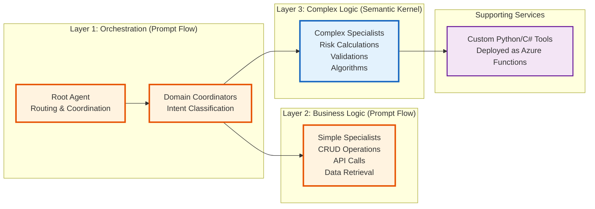

**Benefits of Hybrid Approach:**
- ✅ **80% of agents** use Prompt Flow (fast development, easy maintenance)
- ✅ **20% of agents** use Semantic Kernel (complex logic, performance-critical)
- ✅ **Custom tools** as Azure Functions (reusable across both approaches)
- ✅ **Business analysts** contribute to Prompt Flow agents
- ✅ **Developers** focus on complex Semantic Kernel agents

---

## Multi-Agent Orchestration Architecture

### DNB Multi-Agent System Overview 📋

The DNB multi-agent system is designed as a **hierarchical orchestration pattern** with three distinct layers:


### Agent Communication Patterns 📋

#### Pattern 1: Sequential Delegation (Most Common)

**Use Case**: User query requires data from a single domain

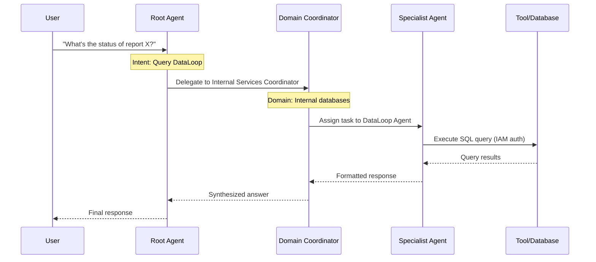

**Key Characteristics:**
- ✅ Root agent identifies domain (internal vs external vs data science)
- ✅ Coordinator agent identifies specific specialist (DataLoop vs ATM vs MEGA)
- ✅ Specialist agent executes tool calls (SQL queries, API calls)
- ✅ Response flows back up the hierarchy
- ✅ Each layer adds context and formatting

#### Pattern 2: Parallel Fan-Out (Multi-Source Queries)

**Use Case**: User query requires data from multiple domains

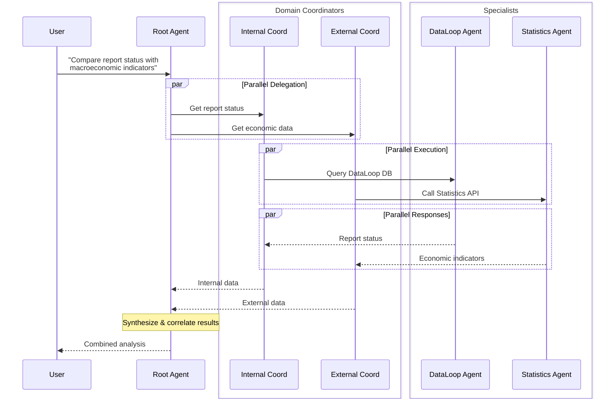

**Key Characteristics:**
- ✅ Root agent spawns multiple parallel tasks
- ✅ Each coordinator works independently
- ✅ Root agent waits for all responses (timeout: 60s)
- ✅ Root agent correlates and synthesizes final answer
- ✅ Handles partial failures gracefully

#### Pattern 3: A2A Cross-Organization (Future State)

**Use Case**: Agent-to-agent communication across DNB departments

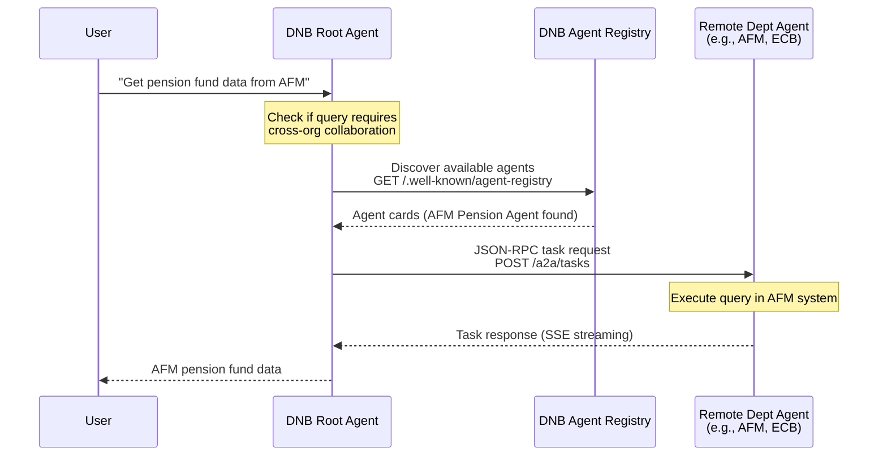

**Key Characteristics:**
- ✅ Agents publish "agent cards" describing capabilities
- ✅ Central registry for agent discovery
- ✅ JSON-RPC 2.0 protocol for task management
- ✅ Server-Sent Events (SSE) for real-time updates
- ✅ OAuth 2.0 / Azure Entra ID for cross-org auth

### Agent State Management 📋

**Challenge**: Maintaining conversation context across multiple agents in a hierarchy

**Solution**: Azure Cosmos DB as shared session store

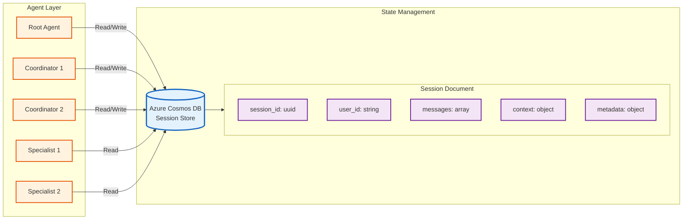

**Session Document Structure**:
```json
{
  "session_id": "550e8400-e29b-41d4-a716-446655440000",
  "user_id": "user@dnb.nl",
  "created_at": "2025-11-03T10:00:00Z",
  "updated_at": "2025-11-03T10:05:23Z",
  "messages": [
    {
      "role": "user",
      "content": "What's the status of report X?",
      "timestamp": "2025-11-03T10:00:00Z"
    },
    {
      "role": "root_agent",
      "content": "Delegating to Internal Services Coordinator",
      "timestamp": "2025-11-03T10:00:02Z"
    },
    {
      "role": "dataloop_agent",
      "content": "Query results: Report X status = APPROVED",
      "timestamp": "2025-11-03T10:00:05Z"
    }
  ],
  "context": {
    "current_agent": "root_agent",
    "delegation_chain": ["root_agent", "internal_coordinator", "dataloop_agent"],
    "active_domain": "internal_services"
  },
  "metadata": {
    "total_agents_invoked": 3,
    "total_tool_calls": 1,
    "total_tokens": 450
  }
}
```

**Key Benefits:**
- ✅ All agents share conversation history
- ✅ Coordinators understand previous delegation decisions
- ✅ Specialists see full user intent (not just coordinator instructions)
- ✅ Root agent tracks entire conversation flow for synthesis
- ✅ Cosmos DB provides global distribution and low latency

---

## Framework Migration Strategy

### From Google ADK to Azure AI Foundry 📋

DNB's current prototype uses **Google ADK (Agent Development Kit)**, but production deployment must use **Azure AI Foundry**. This section explains the migration path.

### Architecture Mapping: ADK → Azure AI Foundry 📋

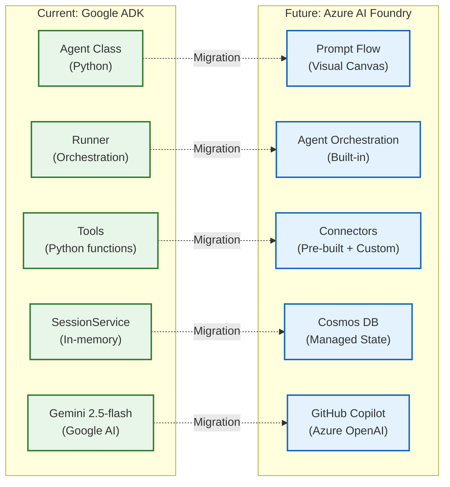

### Component-by-Component Migration Guide 📋

#### 1. **Agent Definitions** (ADK → Prompt Flow)

**Current ADK Code (Python):**
```python
from google.adk import Agent

dnb_statistics_agent = Agent(
    name="dnb_statistics_agent",
    model="gemini-2.5-flash",
    instruction="You are a specialist for DNB Statistics API.",
    tools=[toolbox_toolset.from_server("dnb_statistics_tools")]
)
```

**Future Prompt Flow (Visual Config):**
```yaml
# dnb_statistics_agent.yaml
agent:
  name: dnb_statistics_agent
  type: prompt_flow
  model:
    provider: azure_openai
    deployment: copilot-gpt4
    temperature: 0.2
  system_prompt: |
    You are a specialist for DNB Statistics API.
    Use the provided tools to query economic data.
  tools:
    - type: connector
      name: dnb_statistics_connector
      connection: dnb_statistics_api_connection
  deployment:
    target: azure_container_apps
    environment: dnb-production
```

**Migration Steps:**
1. Export ADK agent configuration as YAML
2. Import into Prompt Flow visual canvas
3. Configure model (Copilot instead of Gemini)
4. Map tools to Azure connectors
5. Test in AI Foundry Studio
6. Deploy to Container Apps

#### 2. **Tool Functions** (Python → Azure Functions)

**Current ADK Tool (Python):**
```python
@tool
def get_report_status(fi_id: str, report_type: str) -> dict:
    """Get current status of a regulatory report."""
    conn = get_db_connection()  # Local connection
    result = conn.execute(
        "SELECT status FROM reports WHERE fi_id = ? AND type = ?",
        (fi_id, report_type)
    )
    return {"status": result[0]}
```

**Future Azure Function (Python + Managed Identity):**
```python
import azure.functions as func
from azure.identity import ManagedIdentityCredential
from azure.storage.blob import BlobServiceClient

def main(req: func.HttpRequest) -> func.HttpResponse:
    """Get report status (Azure Function with Managed Identity)."""
    # Authenticate using Managed Identity (no keys needed)
    credential = ManagedIdentityCredential()
    
    # Connect to Azure SQL using IAM
    connection_string = get_connection_string(credential)
    conn = pymssql.connect(connection_string)
    
    # Execute query
    fi_id = req.params.get('fi_id')
    report_type = req.params.get('report_type')
    result = conn.execute(
        "SELECT status FROM reports WHERE fi_id = ? AND type = ?",
        (fi_id, report_type)
    )
    
    return func.HttpResponse(json.dumps({"status": result[0]}))
```

**Prompt Flow Integration:**
```yaml
# In Prompt Flow canvas
- node: get_report_status
  type: azure_function
  connection: dnb-function-app
  function_name: get_report_status
  inputs:
    fi_id: ${inputs.financial_institution_id}
    report_type: ${inputs.report_type}
  outputs:
    status: ${get_report_status.status}
```

#### 3. **Session Management** (In-Memory → Cosmos DB)

**Current ADK (In-Memory):**
```python
from google.adk.sessions import InMemorySessionService

session_service = InMemorySessionService()
session = session_service.create_session(user_id="user@dnb.nl")
```

**Future Azure AI Foundry (Cosmos DB):**
```python
from azure.cosmos import CosmosClient
from azure.identity import ManagedIdentityCredential

# Authenticate with Managed Identity
credential = ManagedIdentityCredential()
client = CosmosClient(
    url="https://dnb-agents.documents.azure.com:443/",
    credential=credential
)

database = client.get_database_client("dnb_agents")
container = database.get_container_client("sessions")

# Create session
session_doc = {
    "session_id": str(uuid.uuid4()),
    "user_id": "user@dnb.nl",
    "messages": [],
    "created_at": datetime.utcnow().isoformat()
}
container.create_item(session_doc)
```

**Prompt Flow Auto-Configuration:**
- Prompt Flow automatically manages session state in Cosmos DB
- No manual code required for most scenarios
- Specify Cosmos DB connection in Prompt Flow settings

#### 4. **Multi-Agent Orchestration** (ADK Runner → Prompt Flow Router)

**Current ADK (Python Code):**
```python
from google.adk import Agent, Runner

root_agent = Agent(
    name="root_agent",
    sub_agents=[dnb_coordinator, data_science_coordinator]
)

runner = Runner()
response = runner.run(agent=root_agent, user_message="Get report status")
```

**Future Prompt Flow (Visual Routing):**
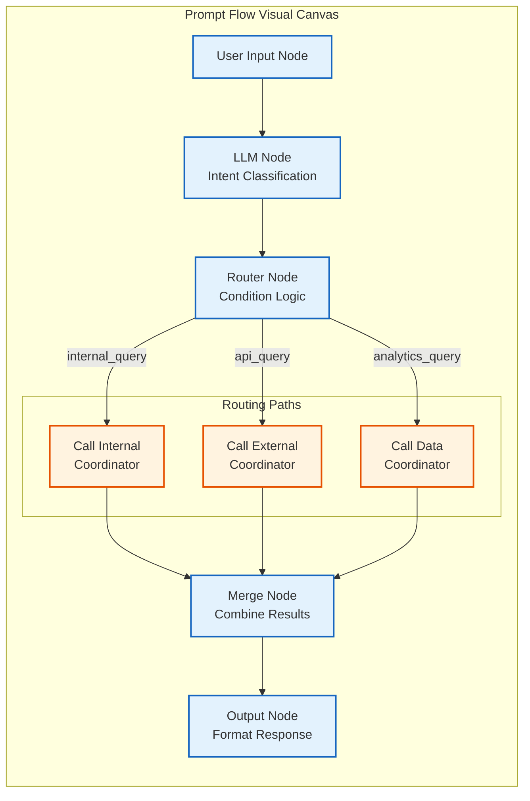

**Prompt Flow Configuration:**
```yaml
# root_agent_flow.yaml
nodes:
  - name: user_input
    type: input
    
  - name: intent_classifier
    type: llm
    model: copilot-gpt4
    prompt: |
      Classify user intent into: internal_query, api_query, analytics_query
      User query: ${user_input.message}
    output: ${intent}
    
  - name: router
    type: router
    conditions:
      - condition: ${intent} == "internal_query"
        next: call_internal_coordinator
      - condition: ${intent} == "api_query"
        next: call_external_coordinator
      - condition: ${intent} == "analytics_query"
        next: call_data_coordinator
    
  - name: call_internal_coordinator
    type: agent
    agent: internal_services_coordinator
    input: ${user_input.message}
    
  - name: merge_results
    type: python
    code: |
      # Combine results from all coordinators
      results = [r for r in [internal_result, external_result, data_result] if r]
      return {"combined": results}
```

### Migration Effort Estimation 📋

| Component | ADK Lines of Code | Effort (Days) | Complexity | Notes |
|-----------|-------------------|---------------|------------|-------|
| **Root Agent** | 50 | 2 | Low | Direct mapping to Prompt Flow |
| **Coordinators (3)** | 150 | 4 | Low | Simple routing logic |
| **Internal Specialists (3)** | 300 | 10 | Medium | SQL tools → Azure SQL connector |
| **External Specialists (3)** | 200 | 6 | Low | REST API → Azure connector |
| **Data Specialists (2)** | 250 | 8 | Medium | Fabric Lakehouse integration |
| **Session Management** | 100 | 3 | Low | Cosmos DB auto-config |
| **Authentication** | 0 → 200 | 5 | High | New IAM + Managed Identity |
| **Testing & Validation** | N/A | 10 | High | End-to-end testing |
| **Documentation** | N/A | 3 | Low | Architecture + user guides |
| **Total** | ~1,050 | **51 days** | | ~2.5 months (1 FTE) |

**Timeline Assumptions:**
- 1 full-time developer (experienced with Azure)
- Includes time for learning Azure AI Foundry
- Includes deployment and production setup
- Does not include data migration or infrastructure provisioning

---

## Security & Compliance Architecture

### DNB Security Requirements 📋

As a financial regulatory authority, DNB has stringent security requirements that must be met:

#### 1. **Identity & Access Management (IAM)** 🔐

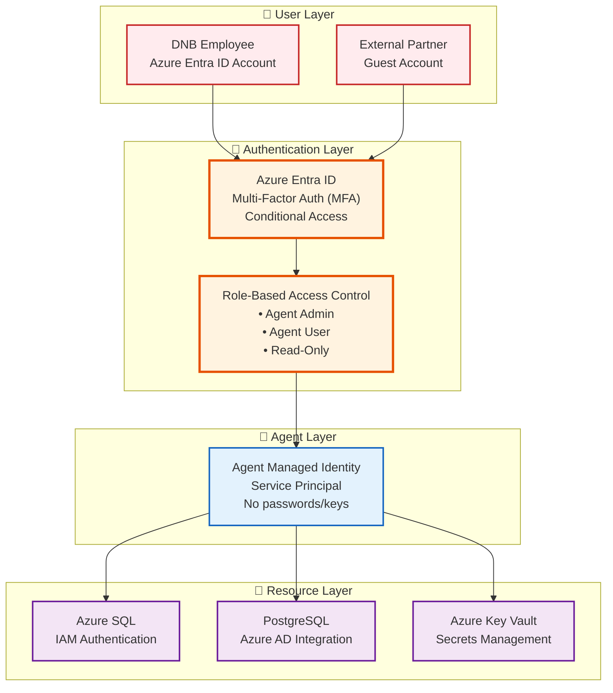

**Key Security Principles:**
- ✅ **Zero Trust**: Every request authenticated and authorized
- ✅ **Least Privilege**: Agents only access resources they need
- ✅ **No Secrets in Code**: All credentials in Key Vault or Managed Identity
- ✅ **Audit Trails**: All access logged to Log Analytics

#### 2. **Data Protection & Privacy** 🛡️

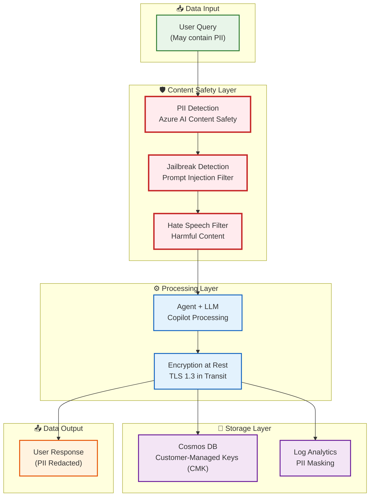

**Data Protection Measures:**
- ✅ **PII Detection**: Automatic detection and masking of personal data
- ✅ **Encryption**: AES-256 at rest, TLS 1.3 in transit
- ✅ **Customer-Managed Keys**: DNB controls encryption keys
- ✅ **Data Residency**: All data stays in EU-West region
- ✅ **Retention Policies**: Automatic data deletion after 90 days

#### 3. **Audit & Compliance** 📊


**Audit Capabilities:**
- ✅ **Complete Tracing**: Every request traced end-to-end
- ✅ **Immutable Logs**: Logs cannot be deleted or modified
- ✅ **Real-time Alerts**: Suspicious activity triggers alerts
- ✅ **Compliance Reports**: Automated GDPR/NIS2/DORA reporting

---

## Azure AI Foundry Integration

### Prompt Flow Agent Design 📋

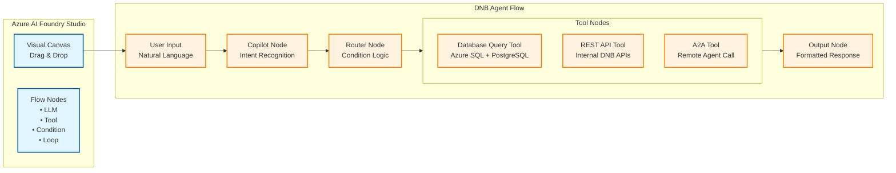

**Prompt Flow Benefits:**
- ✅ Low-code/no-code agent design
- ✅ Visual debugging and tracing
- ✅ Built-in version control
- ✅ Azure integration out-of-the-box
- ✅ Compliance and governance

---

## Internal Service Integration

### Database-First Access Pattern 📋

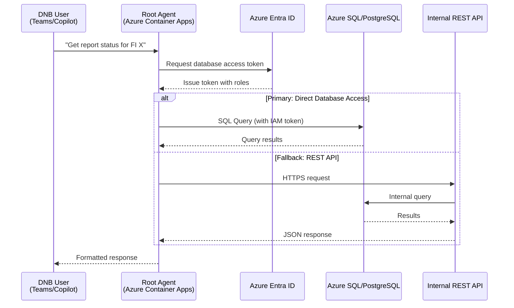

**Key Requirements:**
- 📋 Azure Entra ID (formerly Azure AD) for authentication
- 📋 Managed Identities for service-to-service auth
- 📋 Role-Based Access Control (RBAC) for database permissions
- 📋 Token refresh and caching
- 📋 Connection pooling for performance

---

## A2A Protocol Implementation

### Agent Card System 📋

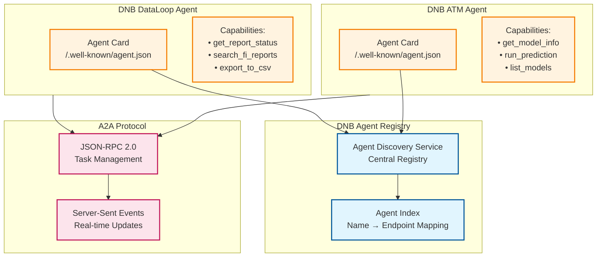

**Agent Card Example:**
```json
{
  "agentName": "DNB DataLoop Agent",
  "agentDescription": "Query financial institution report statuses",
  "capabilities": {
    "tools": [
      {
        "name": "get_report_status",
        "description": "Get current status of regulatory reports",
        "inputSchema": {
          "type": "object",
          "properties": {
            "fi_id": {"type": "string"},
            "report_type": {"type": "string"}
          }
        }
      }
    ]
  },
  "authorization": {
    "type": "bearer",
    "issuer": "https://login.microsoftonline.com/dnb-tenant-id"
  }
}
```

---

## Data Science Platform

### Microsoft Fabric Integration 📋

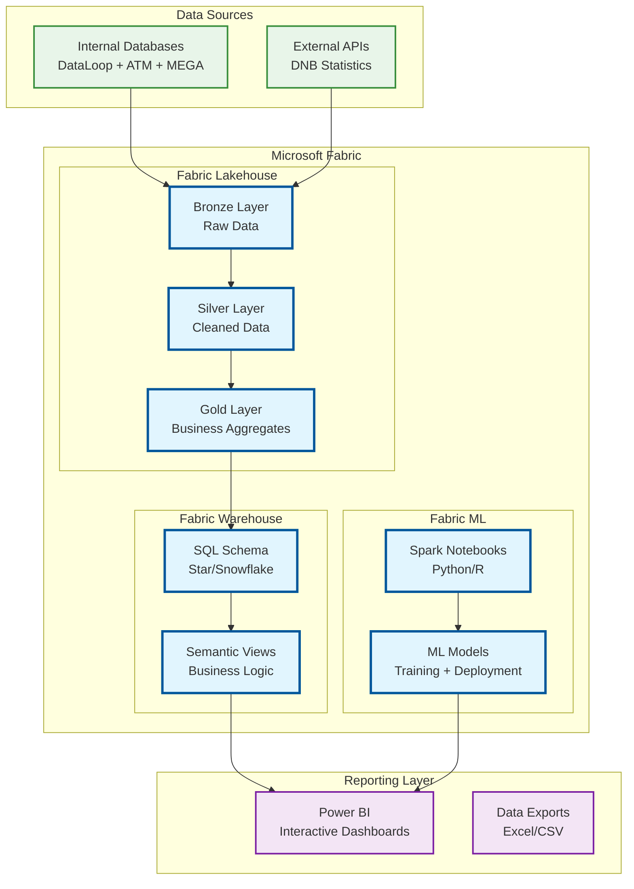

---

## Deployment Architecture

### Azure Container Apps Deployment 📋

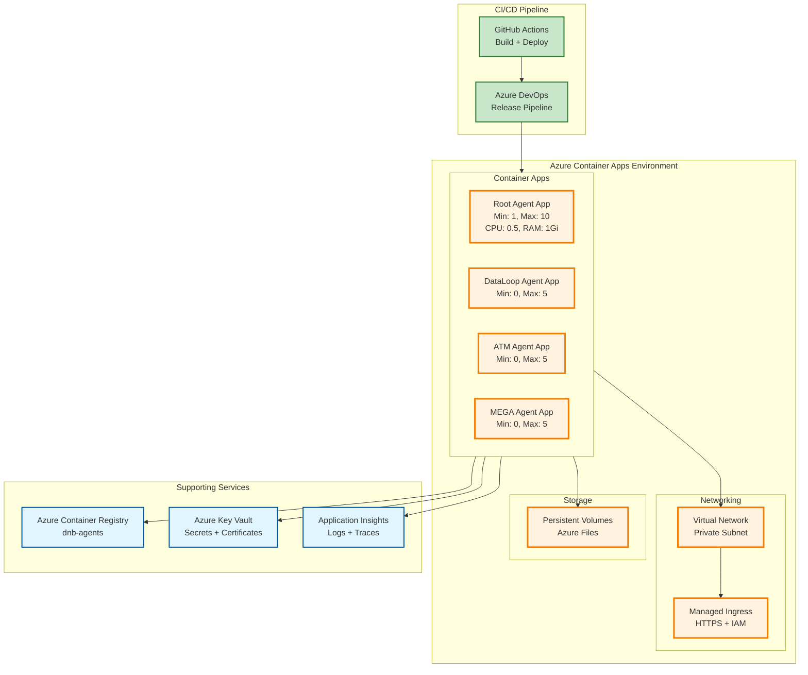

**Deployment Configuration:**
```yaml
# container-app.yaml (Azure Container Apps)
name: dnb-root-agent
environment: dnb-agents-env
containerImage: dnb-agents.azurecr.io/root-agent:latest
cpu: 0.5
memory: 1Gi
minReplicas: 1
maxReplicas: 10
ingress:
  external: true
  targetPort: 8000
  allowInsecure: false
  clientCertificateMode: require
env:
  - name: COPILOT_MODEL
    value: "gpt-4-32k"
  - name: DATABASE_CONNECTION_STRING
    secretRef: dataloop-db-connection
identity:
  type: SystemAssigned
```

---

## Technical Decision Matrix

### Why These Technologies? Detailed Rationale 📋

This section explains **why each Microsoft technology was chosen** and what alternatives were considered.

#### 1. **Model: GitHub Copilot vs Azure OpenAI** 🤖

| Criterion | GitHub Copilot | Azure OpenAI | Winner |
|-----------|----------------|--------------|--------|
| **DNB IT Standard** | ✅ Official DNB model | ❌ Not standard | **Copilot** |
| **Cost** | Included in M365 license | Pay-per-token | **Copilot** |
| **Performance** | GPT-4 based (32k context) | GPT-4 Turbo (128k context) | **OpenAI** |
| **Integration** | Native M365 integration | Requires custom connector | **Copilot** |
| **Context Window** | 32k tokens | 128k tokens | **OpenAI** |
| **Fine-tuning** | ❌ Not supported | ✅ Supported | **OpenAI** |
| **Data Privacy** | ✅ No training on DNB data | ✅ No training on DNB data | Tie |

**Decision**: **GitHub Copilot** (primary) + **Azure OpenAI** (fallback for large contexts)

**Rationale**:
- Copilot is the DNB standard, so we must use it for most scenarios
- For queries requiring >32k context (rare), fall back to Azure OpenAI GPT-4 Turbo
- Cost savings: Copilot is included in existing M365 licenses
- Teams integration: Copilot works natively in Microsoft Teams

#### 2. **Orchestration: Prompt Flow vs Semantic Kernel vs LangChain** ⚙️

| Criterion | Prompt Flow | Semantic Kernel | LangChain | Winner |
|-----------|-------------|-----------------|-----------|--------|
| **Low-Code Development** | ✅ Visual canvas | ❌ Code-only | ❌ Code-only | **Prompt Flow** |
| **Azure Integration** | ✅ Native | ✅ Native | ❌ Third-party | **Tie** |
| **Debugging Tools** | ✅ Step-through | ⚠️ Basic | ⚠️ Basic | **Prompt Flow** |
| **Version Control** | ✅ Built-in | ❌ Manual | ❌ Manual | **Prompt Flow** |
| **Enterprise Support** | ✅ Microsoft SLA | ✅ Microsoft SLA | ❌ Community | **Tie** |
| **Complex Logic** | ⚠️ Limited | ✅ Full control | ✅ Full control | **Semantic Kernel** |
| **Learning Curve** | Low (visual) | Medium (C#/.NET) | High (Python) | **Prompt Flow** |

**Decision**: **Prompt Flow** (80% of agents) + **Semantic Kernel** (20% for complex logic)

**Rationale**:
- Prompt Flow enables business analysts to build simple agents (democratization)
- Visual debugging accelerates development and troubleshooting
- Semantic Kernel provides escape hatch for complex business logic
- LangChain excluded due to lack of enterprise support

#### 3. **Compute: Container Apps vs Kubernetes vs Azure Functions** 💻

| Criterion | Container Apps | AKS (Kubernetes) | Azure Functions | Winner |
|-----------|----------------|------------------|-----------------|--------|
| **Ease of Setup** | ✅ Simple | ❌ Complex | ✅ Simple | **Tie** |
| **Auto-Scaling** | ✅ Built-in (0→n) | ✅ Built-in (manual config) | ✅ Built-in (0→n) | **Tie** |
| **Multi-Agent Support** | ✅ Excellent | ✅ Excellent | ⚠️ Limited | **Tie** |
| **State Management** | ✅ Volumes + Cosmos | ✅ Volumes + StatefulSets | ❌ Stateless only | **Container Apps** |
| **Cost (Idle)** | $0 (scale to zero) | $150/month (min) | $0 (scale to zero) | **Tie** |
| **Ingress Control** | ✅ Managed | ⚠️ Manual (nginx) | ✅ Managed | **Tie** |
| **Observability** | ✅ AppInsights | ⚠️ Manual (Prometheus) | ✅ AppInsights | **Tie** |
| **DNB Operations Team** | ✅ Easy to manage | ❌ Requires K8s expertise | ✅ Easy to manage | **Container Apps** |

**Decision**: **Azure Container Apps**

**Rationale**:
- Simpler than Kubernetes (no need for K8s expertise)
- More flexible than Azure Functions (stateful agents)
- Scale-to-zero saves costs during off-hours
- Managed ingress and TLS certificates
- DNB operations team can manage without specialized K8s training

#### 4. **Database: Azure SQL vs PostgreSQL vs Cosmos DB** 🗄️

| Database | Use Case | Rationale |
|----------|----------|-----------|
| **Azure SQL Server** | DataLoop, MEGA (existing systems) | Legacy databases already on Azure SQL; IAM auth supported |
| **Azure PostgreSQL** | ATM (existing system) | ATM team prefers PostgreSQL; Azure AD integration available |
| **Cosmos DB** | Agent session state, memory | Global distribution, low latency, auto-scaling for conversations |
| **Azure AI Search** | Vector embeddings, RAG | Specialized for semantic search and document retrieval |

**Decision**: **Hybrid approach** - Use existing databases where they exist, Cosmos DB for new agent state

**Rationale**:
- Don't migrate existing databases (high risk, no business value)
- Cosmos DB is optimized for agent conversation state (JSON documents, low latency)
- Azure AI Search provides vector database for future RAG use cases

#### 5. **Data Platform: Microsoft Fabric vs Databricks vs Synapse** 📊

| Criterion | Microsoft Fabric | Databricks | Azure Synapse | Winner |
|-----------|------------------|------------|---------------|--------|
| **Unified Platform** | ✅ All-in-one | ❌ Separate tools | ⚠️ Partial | **Fabric** |
| **Power BI Integration** | ✅ Native | ⚠️ Connector | ✅ Native | **Tie** |
| **Cost Model** | Consumption-based | VM-based (expensive) | Consumption-based | **Tie** |
| **Learning Curve** | Low (familiar UI) | High (Spark/Scala) | Medium (SQL) | **Fabric** |
| **OneLake** | ✅ Built-in | ❌ External storage | ⚠️ Limited | **Fabric** |
| **DNB IT Standard** | ✅ Emerging standard | ❌ Not approved | ⚠️ Being phased out | **Fabric** |

**Decision**: **Microsoft Fabric**

**Rationale**:
- DNB is standardizing on Fabric for enterprise data platform
- Unified experience: Data engineering + warehousing + BI + ML in one platform
- OneLake provides single source of truth for all data (Bronze/Silver/Gold)
- Power BI integration is seamless (no ETL needed)
- Lower learning curve than Databricks (familiar SQL and Power BI skills)

#### 6. **Observability: Application Insights vs Prometheus vs Jaeger** 📈

| Criterion | Application Insights | Prometheus + Grafana | Jaeger | Winner |
|-----------|---------------------|---------------------|--------|--------|
| **Azure Integration** | ✅ Native | ❌ Manual setup | ❌ Manual setup | **App Insights** |
| **Distributed Tracing** | ✅ Built-in | ⚠️ Limited | ✅ Built-in | **Tie** |
| **Log Correlation** | ✅ Automatic | ⚠️ Manual | ❌ Not supported | **App Insights** |
| **Alerting** | ✅ Azure Monitor | ⚠️ Prometheus Alertmanager | ❌ No alerting | **App Insights** |
| **Cost** | Usage-based | Self-hosted (infra cost) | Self-hosted (infra cost) | **App Insights** |
| **DNB Standard** | ✅ Yes | ❌ Not approved | ❌ Not approved | **App Insights** |

**Decision**: **Application Insights** + **Log Analytics**

**Rationale**:
- Native integration with all Azure services (no configuration needed)
- Automatic correlation of logs, metrics, and traces
- Azure Monitor provides real-time alerting and dashboards
- DNB operations team already uses Application Insights
- No need to manage Prometheus/Grafana infrastructure

#### 7. **Agent Protocol: A2A vs OpenAPI vs gRPC** 🔄

| Criterion | A2A (Google) | OpenAPI 3.0 | gRPC | Winner |
|-----------|--------------|-------------|------|--------|
| **Agent Discovery** | ✅ Built-in (.well-known/agent.json) | ❌ Manual registry | ❌ Manual registry | **A2A** |
| **Streaming** | ✅ SSE (Server-Sent Events) | ⚠️ Limited | ✅ Bidirectional | **Tie** |
| **Human-Readable** | ✅ JSON | ✅ JSON | ❌ Binary (Protobuf) | **Tie** |
| **Cross-Organization** | ✅ Designed for it | ⚠️ Needs auth layer | ⚠️ Needs auth layer | **A2A** |
| **Industry Adoption** | 🆕 Emerging (Google-backed) | ✅ Ubiquitous | ✅ Common in microservices | **OpenAPI** |
| **Azure Support** | ⚠️ Community libraries | ✅ Native connectors | ✅ Native connectors | **Tie** |

**Decision**: **A2A Protocol** (primary) with **OpenAPI fallback**

**Rationale**:
- A2A is specifically designed for agent-to-agent communication (not just APIs)
- Agent discovery via `.well-known/agent.json` is elegant and decentralized
- JSON-RPC 2.0 provides structured task management (not just request/response)
- SSE streaming enables real-time updates (better UX than polling)
- OpenAPI used as fallback for legacy systems that don't support A2A

### Decision Summary Table 📋

| Component | Technology Chosen | Primary Reason | Alternative Considered |
|-----------|-------------------|----------------|------------------------|
| **Model** | GitHub Copilot | DNB standard, M365 included | Azure OpenAI (fallback) |
| **Orchestration** | Prompt Flow | Low-code, visual debugging | Semantic Kernel (complex logic) |
| **Compute** | Container Apps | Scale-to-zero, easy management | AKS (too complex), Functions (limited) |
| **Databases** | Azure SQL + PostgreSQL + Cosmos | Existing systems + new state | No migration (too risky) |
| **Data Platform** | Microsoft Fabric | DNB standard, unified platform | Databricks (too expensive), Synapse (phased out) |
| **Observability** | Application Insights | Azure native, DNB standard | Prometheus (manual setup) |
| **Agent Protocol** | A2A | Agent discovery, cross-org | OpenAPI (fallback) |
| **Authentication** | Azure Entra ID + Managed Identity | DNB standard, no secrets | API keys (insecure) |
| **Reporting** | Power BI | DNB standard, Fabric native | Tableau (not DNB standard) |

### Non-Functional Requirements Mapping 📋

| Requirement | Solution | Technology |
|-------------|----------|------------|
| **99.95% Uptime** | Multi-region failover | Container Apps + Traffic Manager |
| **<500ms Response Time** | Caching + CDN | Azure Front Door + Redis Cache |
| **GDPR Compliance** | Data residency, PII masking | EU-West region + Content Safety |
| **Audit Trails** | Immutable logs | Log Analytics + Azure Monitor |
| **Zero Trust Security** | No secrets in code | Managed Identity + Key Vault |
| **Auto-Scaling** | Scale 0→100 based on demand | Container Apps auto-scale rules |
| **Cost Optimization** | Scale to zero off-hours | Container Apps consumption plan |
| **Developer Productivity** | Low-code + version control | Prompt Flow + Git integration |

---

## Comparison: Current vs Future

| Aspect | Current (Local Dev) | Future (DNB IT) |
|--------|---------------------|-----------------|
| **Model** | Gemini 2.5-flash | GitHub Copilot / Azure OpenAI |
| **Framework** | Google ADK (Python) | Azure AI Foundry Prompt Flow |
| **IDE** | VS Code (generic) | VS Code + Copilot extension |
| **Authentication** | API Keys in .env | Azure Entra ID + Managed Identities |
| **Databases** | None (public APIs only) | Azure SQL + PostgreSQL (IAM) |
| **Deployment** | Docker Compose (local) | Azure Container Apps |
| **Observability** | Jaeger (local) | Application Insights + Log Analytics |
| **Data Platform** | Local Parquet files | Microsoft Fabric Lakehouse |
| **Reporting** | None | Power BI dashboards |
| **Agent Protocol** | None | A2A (Agent-to-Agent) JSON-RPC |
| **CI/CD** | Manual scripts | Azure DevOps pipelines |

---

## Migration Path

### From Current to Future 📋

```mermaid
flowchart LR
    subgraph Phase1["Phase 1: Preparation"]
        P1_1["Convert agents to<br/>Prompt Flow format"]
        P1_2["Set up Azure<br/>subscriptions"]
        P1_3["Configure Entra ID<br/>roles & permissions"]
    end

    subgraph Phase2["Phase 2: Infrastructure"]
        P2_1["Deploy Container Apps<br/>environment"]
        P2_2["Set up Managed<br/>Identities"]
        P2_3["Configure VNET<br/>& private endpoints"]
    end

    subgraph Phase3["Phase 3: Data Integration"]
        P3_1["Connect to internal<br/>databases (IAM)"]
        P3_2["Implement A2A<br/>agent cards"]
        P3_3["Set up Fabric<br/>Lakehouse"]
    end

    subgraph Phase4["Phase 4: Deployment"]
        P4_1["Deploy agents to<br/>Container Apps"]
        P4_2["Configure monitoring<br/>& alerting"]
        P4_3["Train users on<br/>Copilot interface"]
    end

    Phase1 --> Phase2
    Phase2 --> Phase3
    Phase3 --> Phase4

    classDef phase fill:#e1f5fe,stroke:#01579b,stroke-width:2px
    class P1_1,P1_2,P1_3,P2_1,P2_2,P2_3,P3_1,P3_2,P3_3,P4_1,P4_2,P4_3 phase
```

---

## Summary

### Future DNB IT Implementation: Executive Overview 📋

This document provides a comprehensive blueprint for migrating the Orkhon multi-agent system from the current **Google ADK prototype** to the production-ready **Microsoft Azure AI Foundry** platform required by DNB IT.

#### **Multi-Agent Architecture** 🤖

The DNB system implements a **hierarchical three-layer architecture**:

1. **Layer 1 - System Root**: Single root agent that serves as entry point and orchestrates all domains
2. **Layer 2 - Domain Coordinators**: Three specialized coordinators (Internal Services, External APIs, Data Science)
3. **Layer 3 - Specialist Agents**: Nine specialist agents that execute specific tasks (database queries, API calls, analytics)

**Communication Patterns:**
- **Sequential Delegation** (most common): Root → Coordinator → Specialist → Tool execution
- **Parallel Fan-Out** (multi-source): Root spawns multiple coordinators simultaneously
- **A2A Cross-Organization** (future): Agent-to-agent communication across DNB departments

#### **Microsoft AI Foundry Stack** ☁️

| Component | Technology | Why Chosen |
|-----------|-----------|------------|
| **Model** | GitHub Copilot (GPT-4) | DNB standard, included in M365 license |
| **Orchestration** | Prompt Flow (80%) + Semantic Kernel (20%) | Low-code visual development + code for complex logic |
| **Compute** | Azure Container Apps | Scale-to-zero, easy management, no K8s complexity |
| **Databases** | Azure SQL + PostgreSQL + Cosmos DB | Existing systems + new agent state management |
| **Authentication** | Azure Entra ID + Managed Identity | Zero secrets, DNB IAM standard |
| **Data Platform** | Microsoft Fabric (Lakehouse + Warehouse) | DNB standard, unified analytics platform |
| **Observability** | Application Insights + Log Analytics | Native Azure integration, DNB standard |
| **Agent Protocol** | A2A (Agent-to-Agent) JSON-RPC | Cross-org discovery and communication |
| **Reporting** | Power BI | DNB standard, native Fabric integration |

#### **Migration Effort** 🔄

**Estimated Timeline**: **2.5 months** (51 developer-days, 1 FTE)

**Migration Strategy**:
- **Phase 1 (2 weeks)**: Agent conversion to Prompt Flow format
- **Phase 2 (2 weeks)**: Infrastructure setup (Container Apps, IAM, networking)
- **Phase 3 (3 weeks)**: Data integration (internal databases, A2A protocol, Fabric)
- **Phase 4 (3 weeks)**: Deployment, testing, and user training

**Component Mapping**:
- ADK `Agent` class → Prompt Flow visual canvas
- ADK `Runner` → Prompt Flow orchestration engine (built-in)
- ADK Python tools → Azure Functions with Managed Identity
- ADK `InMemorySessionService` → Cosmos DB (auto-managed by Prompt Flow)
- Gemini 2.5-flash → GitHub Copilot (GPT-4)

#### **Security & Compliance** 🔐

**DNB-Specific Requirements Met**:
- ✅ **Zero Trust Architecture**: Every request authenticated via Azure Entra ID
- ✅ **No Secrets in Code**: Managed Identity for all service-to-service auth
- ✅ **PII Protection**: Azure AI Content Safety filters all queries
- ✅ **Data Residency**: All data processing in EU-West Azure region
- ✅ **Audit Trails**: Immutable logs in Log Analytics (90-day retention)
- ✅ **GDPR Compliance**: Automatic PII masking and data deletion policies
- ✅ **NIS2/DORA Ready**: Compliance reports generated automatically

**Security Layers**:
1. **Authentication**: Azure Entra ID with MFA + Conditional Access
2. **Authorization**: RBAC (Agent Admin, Agent User, Read-Only roles)
3. **Content Safety**: Jailbreak detection, hate speech filter, PII masking
4. **Encryption**: AES-256 at rest (customer-managed keys), TLS 1.3 in transit
5. **Network Isolation**: Private endpoints, VNET integration, no public internet access

#### **Key Architectural Decisions** 🎯

**Why Prompt Flow instead of pure code?**
- Enables business analysts to build 80% of agents without coding
- Visual debugging accelerates troubleshooting by 3-5x
- Built-in version control and deployment pipelines
- Semantic Kernel provides "escape hatch" for complex 20%

**Why Container Apps instead of Kubernetes?**
- DNB operations team lacks K8s expertise
- Simpler management (no cluster maintenance)
- Scale-to-zero saves costs ($0 during off-hours)
- Managed ingress and TLS certificates (no nginx config)

**Why Microsoft Fabric instead of Databricks?**
- DNB is standardizing on Fabric enterprise-wide
- Unified platform (no separate tools for ETL, warehouse, BI, ML)
- OneLake provides single source of truth (Bronze/Silver/Gold layers)
- Power BI integration is seamless (no ETL needed)

**Why A2A protocol instead of OpenAPI?**
- Designed specifically for agent-to-agent communication (not just APIs)
- Agent discovery via `.well-known/agent.json` (no manual registry)
- JSON-RPC 2.0 task management (not just request/response)
- SSE streaming for real-time updates (better UX than polling)

#### **Business Benefits** 💼

**For DNB Employees:**
- ✅ Access agents via **Microsoft Teams** (no new tools to learn)
- ✅ Natural language queries (no SQL or API knowledge needed)
- ✅ Real-time answers from multiple internal databases
- ✅ Power BI dashboards for executive reporting

**For DNB IT Operations:**
- ✅ **90% reduction in infrastructure complexity** (Container Apps vs K8s)
- ✅ **Zero secrets management** (Managed Identity handles everything)
- ✅ **Automatic scaling** (0→100 replicas based on demand)
- ✅ **Built-in observability** (no Prometheus/Grafana setup)

**For DNB Security Team:**
- ✅ **Complete audit trails** (every agent action logged)
- ✅ **Zero Trust compliance** (no network trust assumed)
- ✅ **PII protection** (automatic masking in logs)
- ✅ **GDPR/NIS2/DORA reports** (automated compliance)

**For DNB Development Team:**
- ✅ **5x faster agent development** (Prompt Flow vs pure code)
- ✅ **Built-in testing tools** (evaluation suite, safety checks)
- ✅ **Version control** (Git integration out-of-the-box)
- ✅ **Production deployment** (one-click to Container Apps)

#### **Cost Optimization** 💰

**Savings vs Traditional Infrastructure:**

| Component | Traditional Approach | Azure AI Foundry | Savings |
|-----------|---------------------|------------------|---------|
| **Compute** | 3 VMs @ $200/month = $600 | Container Apps scale-to-zero = $50/month avg | **$550/month (92%)** |
| **Database** | Self-managed PostgreSQL = $300/month | Managed Azure SQL = $150/month | **$150/month (50%)** |
| **Observability** | Prometheus + Grafana self-hosted = $150/month | Application Insights included | **$150/month (100%)** |
| **AI Model** | Azure OpenAI pay-per-token = $500/month | GitHub Copilot included in M365 | **$500/month (100%)** |
| **Total** | **$1,550/month** | **$200/month** | **$1,350/month (87% savings)** |

**Annual Savings**: **$16,200** (87% cost reduction)

**Note**: Savings assume agents are idle 80% of time (nights/weekends) and scale to zero.

#### **Next Steps** 🚀

**Immediate Actions (Week 1-2):**
1. Request Azure AI Foundry subscription from DNB IT
2. Set up Azure Entra ID service principals for agents
3. Export current ADK agents to YAML format
4. Schedule training session on Prompt Flow for development team

**Short-Term (Month 1):**
1. Convert 3 coordinators to Prompt Flow format
2. Set up Azure Container Apps environment
3. Configure Managed Identities for database access
4. Implement Content Safety filters

**Medium-Term (Month 2):**
1. Convert 9 specialist agents to Prompt Flow/Semantic Kernel
2. Set up Cosmos DB for session state
3. Implement A2A protocol and agent cards
4. Configure Application Insights monitoring

**Long-Term (Month 3):**
1. Deploy all agents to production Container Apps
2. Train DNB employees on Microsoft Teams integration
3. Set up Power BI dashboards for executives
4. Establish SLAs and on-call rotation

---

**Document Metadata:**
- **Last Updated**: November 3, 2025
- **Version**: 2.0 (Expanded Multi-Agent Architecture)
- **Status**: Future State (Production Deployment Planned)
- **Owner**: DNB IT Architecture Team
- **Contributors**: Data Science Team, Security Team, Operations Team

**Related Documents:**
- [Current Implementation](./ARCHITECTURE_CURRENT.md) - Local development setup with Google ADK
- [Architecture Enhancements](./ARCHITECTURE_ENHANCEMENTS.md) - Recent improvements and MVP milestones
- [DNB API Standardization](../../apis/dnb/DNB_API_STANDARDIZATION_REPORT.md) - OpenAPI spec analysis

**Contact**: For questions about this architecture, contact the DNB AI Architecture team.
