# Orkhon Backend Architecture - DNB IT Implementation (Planned)

> **Future State Documentation**  
> This document describes the **planned deployment** within DNB IT infrastructure with Microsoft Azure AI Foundry and Copilot

---

## 📖 Table of Contents

- [Vision Overview](#vision-overview)
- [DNB IT Stack](#dnb-it-stack)
- [Azure AI Foundry Integration](#azure-ai-foundry-integration)
- [Internal Service Integration](#internal-service-integration)
- [Data Science Platform](#data-science-platform)
- [Deployment Architecture](#deployment-architecture)

---

## Vision Overview

### Future DNB IT Architecture 📋

```mermaid
graph TB
    subgraph DNB_Frontend["🖥️ DNB Frontend 📋"]
        Copilot_UI["Microsoft 365 Copilot<br/>Chat Interface<br/>Teams Integration"]
        Portal["Azure Portal<br/>AI Foundry Studio"]
    end

    subgraph Azure_AI_Foundry["☁️ Azure AI Foundry 📋"]
        direction TB
        
        subgraph Model_Catalog["Model Catalog"]
            Copilot_Model["GitHub Copilot<br/>GPT-4 Based<br/>DNB Standard Model"]
            OpenAI["Azure OpenAI<br/>GPT-4 Turbo<br/>Fallback Option"]
        end
        
        subgraph Prompt_Flow["Prompt Flow"]
            Agent_Orchestrator["Agent Orchestrator<br/>Low-Code Design"]
            Flow_Templates["DNB Flow Templates<br/>Pre-built Workflows"]
        end
        
        subgraph Content_Safety["Content Safety"]
            Safety_Filter["Azure AI Content Safety<br/>Compliance Checks"]
        end
    end

    subgraph DNB_Agents["🤖 DNB Agent System 📋"]
        direction TB
        Root_DNB["Root Agent<br/>GitHub Copilot<br/>Azure Deployment<br/>System Coordinator"]
        
        subgraph Coordinators["Domain Coordinators"]
            Internal_Coord["Internal Services Coordinator<br/>DataLoop + ATM + MEGA"]
            External_Coord["External API Coordinator<br/>DNB Public APIs"]
            Data_Coord["Data Science Coordinator<br/>Analytics + Reporting"]
        end
        
        subgraph Internal_Agents["Internal Service Specialists"]
            DataLoop_Agent["DataLoop Specialist<br/>Azure SQL Tools<br/>IAM Auth"]
            ATM_Agent["ATM Specialist<br/>PostgreSQL Tools<br/>IAM Auth"]
            MEGA_Agent["MEGA Specialist<br/>Azure SQL Tools<br/>IAM Auth"]
        end
        
        subgraph External_Agents["External API Specialists"]
            DNB_Echo["Echo Specialist<br/>Connectivity Tests"]
            DNB_Stats["Statistics Specialist<br/>Economic Data"]
            DNB_PR["Public Register Specialist<br/>Regulatory Data"]
        end
        
        subgraph Data_Agents["Data Science Specialists"]
            Fabric_Agent["Fabric Specialist<br/>Lakehouse Queries"]
            Analytics_Agent["Analytics Specialist<br/>Power BI Integration"]
        end
    end

    subgraph Azure_Services["☁️ Azure Core Services 📋"]
        direction TB
        
        subgraph IAM["Identity & Access"]
            Entra_ID["Azure Entra ID<br/>Role-Based Access"]
            Managed_ID["Managed Identities<br/>Service Principals"]
        end
        
        subgraph Databases["Internal Databases"]
            DataLoop_DB["DataLoop Database<br/>Azure SQL Server<br/>Report Status Data"]
            ATM_DB["ATM Database<br/>Azure PostgreSQL<br/>Model Metadata"]
            MEGA_DB["MEGA Database<br/>Azure SQL Server<br/>Validation Rules"]
        end
        
        subgraph APIs["Internal APIs"]
            DataLoop_API["DataLoop REST API<br/>OpenAPI 3.0"]
            ATM_API["ATM REST API<br/>OpenAPI 3.0"]
            MEGA_API["MEGA REST API<br/>OpenAPI 3.0"]
        end
        
        subgraph Container_Platform["Container Platform"]
            ACA["Azure Container Apps<br/>Agent Deployment<br/>Auto-scaling"]
            ACR["Azure Container Registry<br/>Private Images"]
        end
        
        subgraph Observability["Observability"]
            AppInsights["Application Insights<br/>Tracing + Metrics"]
            LogAnalytics["Log Analytics<br/>Centralized Logs"]
        end
    end

    subgraph A2A_Protocol["🔄 A2A Protocol 📋"]
        A2A_Server["A2A JSON-RPC Server<br/>Agent Card Publishing<br/>/.well-known/agent.json"]
        A2A_Registry["DNB Agent Registry<br/>Cross-Org Discovery"]
    end

    subgraph Data_Platform["📊 Data Platform 📋"]
        direction TB
        
        subgraph Microsoft_Fabric["Microsoft Fabric"]
            Fabric_Lakehouse["Fabric Lakehouse<br/>Bronze/Silver/Gold"]
            Fabric_Warehouse["Fabric Warehouse<br/>Analytics"]
            Fabric_ML["Fabric ML<br/>Model Training"]
        end
        
        subgraph PowerBI["Power BI"]
            Reports["Interactive Reports<br/>Executive Dashboards"]
        end
    end

    %% Connections
    Copilot_UI --> Azure_AI_Foundry
    Portal --> Azure_AI_Foundry
    
    Azure_AI_Foundry --> Copilot_Model
    Azure_AI_Foundry --> Agent_Orchestrator
    Azure_AI_Foundry --> Safety_Filter
    
    Agent_Orchestrator --> Root_DNB
    Root_DNB --> Coordinators
    Internal_Coord --> Internal_Agents
    
    Internal_Agents --> Entra_ID
    Entra_ID --> Managed_ID
    Managed_ID --> DataLoop_DB
    Managed_ID --> ATM_DB
    Managed_ID --> MEGA_DB
    
    DataLoop_DB -.Backed by.-> DataLoop_API
    ATM_DB -.Backed by.-> ATM_API
    MEGA_DB -.Backed by.-> MEGA_API
    
    Root_DNB --> ACA
    ACA --> ACR
    ACA --> AppInsights
    AppInsights --> LogAnalytics
    
    Internal_Agents --> A2A_Server
    A2A_Server --> A2A_Registry
    
    DataLoop_DB --> Fabric_Lakehouse
    Fabric_Lakehouse --> Fabric_Warehouse
    Fabric_Warehouse --> Reports

    classDef dnb_future fill:#fff3e0,stroke:#f57c00,stroke-width:3px
    classDef azure_ai fill:#e1f5fe,stroke:#01579b,stroke-width:3px
    classDef azure_service fill:#bbdefb,stroke:#0d47a1,stroke-width:3px
    classDef data fill:#f3e5f5,stroke:#7b1fa2,stroke-width:2px
    classDef a2a fill:#fce4ec,stroke:#c2185b,stroke-width:2px
    
    class Copilot_UI,Portal,Root_DNB,Internal_Coord,External_Coord,Data_Coord dnb_future
    class Copilot_Model,OpenAI,Agent_Orchestrator,Flow_Templates,Safety_Filter azure_ai
    class Entra_ID,Managed_ID,DataLoop_DB,ATM_DB,MEGA_DB,ACA,ACR,AppInsights,LogAnalytics azure_service
    class Fabric_Lakehouse,Fabric_Warehouse,Fabric_ML,Reports data
    class A2A_Server,A2A_Registry a2a
```



---

## DNB IT Stack

### Required Microsoft Technologies 📋

| Component | Microsoft Technology | Purpose |
|-----------|---------------------|---------|
| **Model** | GitHub Copilot / Azure OpenAI | DNB standard AI model |
| **Orchestration** | Azure AI Foundry Prompt Flow | Low-code agent design |
| **IDE** | Visual Studio Code + Copilot | Development environment |
| **Identity** | Azure Entra ID | Authentication & authorization |
| **Compute** | Azure Container Apps | Serverless container hosting |
| **Databases** | Azure SQL + PostgreSQL | Internal data sources |
| **Observability** | Application Insights | Distributed tracing |
| **Data Platform** | Microsoft Fabric | Lakehouse + Warehouse |
| **Reporting** | Power BI | Executive dashboards |
| **Registry** | Azure Container Registry | Private container images |
| **Protocol** | A2A (Agent-to-Agent) | Cross-org communication |

---

## Azure AI Foundry Integration

### Prompt Flow Agent Design 📋


**Prompt Flow Benefits:**
- ✅ Low-code/no-code agent design
- ✅ Visual debugging and tracing
- ✅ Built-in version control
- ✅ Azure integration out-of-the-box
- ✅ Compliance and governance

---

## Internal Service Integration

### Database-First Access Pattern 📋


**Key Requirements:**
- 📋 Azure Entra ID (formerly Azure AD) for authentication
- 📋 Managed Identities for service-to-service auth
- 📋 Role-Based Access Control (RBAC) for database permissions
- 📋 Token refresh and caching
- 📋 Connection pooling for performance

---

## A2A Protocol Implementation

### Agent Card System 📋

```mermaid
graph TB
    subgraph Agent_A["DNB DataLoop Agent"]
        Card_A["Agent Card<br/>/.well-known/agent.json"]
        Capabilities_A["Capabilities:<br/>• get_report_status<br/>• search_fi_reports<br/>• export_to_csv"]
    end

    subgraph Agent_B["DNB ATM Agent"]
        Card_B["Agent Card<br/>/.well-known/agent.json"]
        Capabilities_B["Capabilities:<br/>• get_model_info<br/>• run_prediction<br/>• list_models"]
    end

    subgraph Registry["DNB Agent Registry"]
        Discovery["Agent Discovery Service<br/>Central Registry"]
        Index["Agent Index<br/>Name → Endpoint Mapping"]
    end

    subgraph Protocol["A2A Protocol"]
        JSON_RPC["JSON-RPC 2.0<br/>Task Management"]
        Streaming["Server-Sent Events<br/>Real-time Updates"]
    end

    Card_A --> Discovery
    Card_B --> Discovery
    Discovery --> Index
    
    Agent_A --> JSON_RPC
    Agent_B --> JSON_RPC
    JSON_RPC --> Streaming

    classDef agent fill:#fff3e0,stroke:#f57c00,stroke-width:2px
    classDef registry fill:#e1f5fe,stroke:#01579b,stroke-width:2px
    classDef protocol fill:#fce4ec,stroke:#c2185b,stroke-width:2px
    
    class Card_A,Capabilities_A,Card_B,Capabilities_B agent
    class Discovery,Index registry
    class JSON_RPC,Streaming protocol
```



**Agent Card Example:**
```json
{
  "agentName": "DNB DataLoop Agent",
  "agentDescription": "Query financial institution report statuses",
  "capabilities": {
    "tools": [
      {
        "name": "get_report_status",
        "description": "Get current status of regulatory reports",
        "inputSchema": {
          "type": "object",
          "properties": {
            "fi_id": {"type": "string"},
            "report_type": {"type": "string"}
          }
        }
      }
    ]
  },
  "authorization": {
    "type": "bearer",
    "issuer": "https://login.microsoftonline.com/dnb-tenant-id"
  }
}
```

---

## Data Science Platform

### Microsoft Fabric Integration 📋


---

## Deployment Architecture

### Azure Container Apps Deployment 📋


**Deployment Configuration:**
```yaml
# container-app.yaml (Azure Container Apps)
name: dnb-root-agent
environment: dnb-agents-env
containerImage: dnb-agents.azurecr.io/root-agent:latest
cpu: 0.5
memory: 1Gi
minReplicas: 1
maxReplicas: 10
ingress:
  external: true
  targetPort: 8000
  allowInsecure: false
  clientCertificateMode: require
env:
  - name: COPILOT_MODEL
    value: "gpt-4-32k"
  - name: DATABASE_CONNECTION_STRING
    secretRef: dataloop-db-connection
identity:
  type: SystemAssigned
```

---

## Comparison: Current vs Future

| Aspect | Current (Local Dev) | Future (DNB IT) |
|--------|---------------------|-----------------|
| **Model** | Gemini 2.5-flash | GitHub Copilot / Azure OpenAI |
| **Framework** | Google ADK (Python) | Azure AI Foundry Prompt Flow |
| **IDE** | VS Code (generic) | VS Code + Copilot extension |
| **Authentication** | API Keys in .env | Azure Entra ID + Managed Identities |
| **Databases** | None (public APIs only) | Azure SQL + PostgreSQL (IAM) |
| **Deployment** | Docker Compose (local) | Azure Container Apps |
| **Observability** | Jaeger (local) | Application Insights + Log Analytics |
| **Data Platform** | Local Parquet files | Microsoft Fabric Lakehouse |
| **Reporting** | None | Power BI dashboards |
| **Agent Protocol** | None | A2A (Agent-to-Agent) JSON-RPC |
| **CI/CD** | Manual scripts | Azure DevOps pipelines |

---

## Migration Path

### From Current to Future 📋


---

## Summary

**Future DNB IT Implementation 📋:**

1. **Model**: GitHub Copilot (DNB standard) replaces Gemini
2. **Orchestration**: Azure AI Foundry Prompt Flow replaces ADK
3. **Identity**: Azure Entra ID + Managed Identities
4. **Databases**: Direct access to DataLoop, ATM, MEGA databases
5. **Platform**: Azure Container Apps + Microsoft Fabric
6. **Protocol**: A2A for cross-organization agent communication
7. **Observability**: Application Insights + Log Analytics
8. **Reporting**: Power BI dashboards for executives

**Key Benefits:**
- ✅ Full compliance with DNB IT standards
- ✅ Centralized identity and access management
- ✅ Native integration with Microsoft 365
- ✅ Enterprise-grade security and governance
- ✅ Unified data platform (Fabric)
- ✅ Production-ready deployment (Container Apps)

---

*Last Updated: October 24, 2025*  
*Version: Future DNB IT Implementation*
