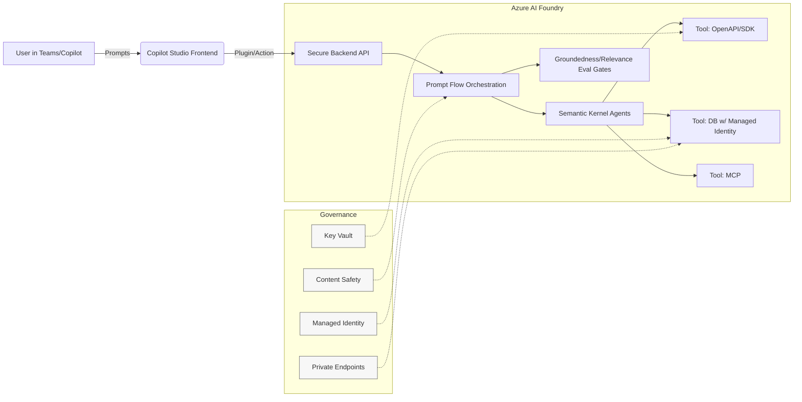
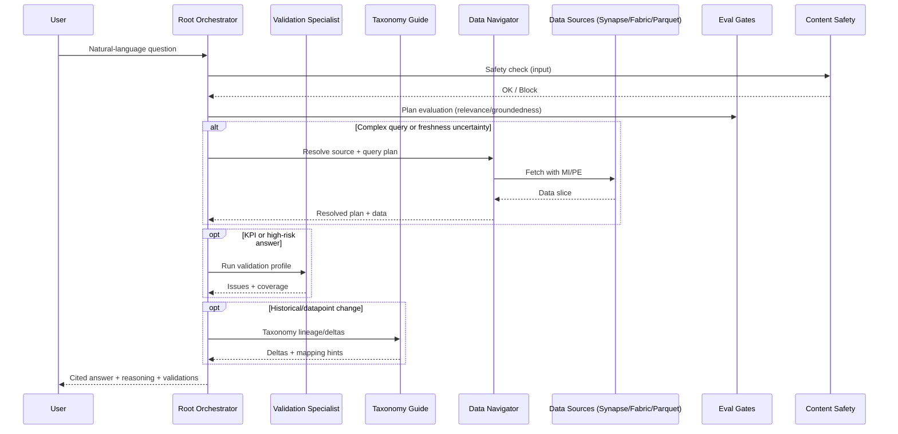
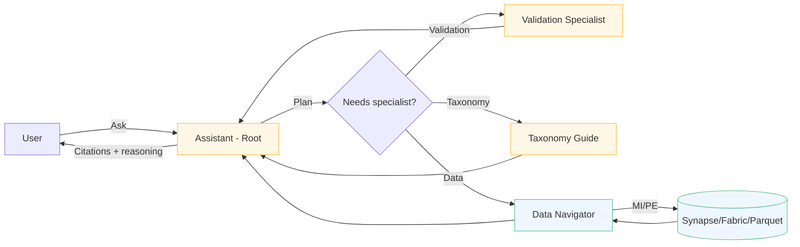
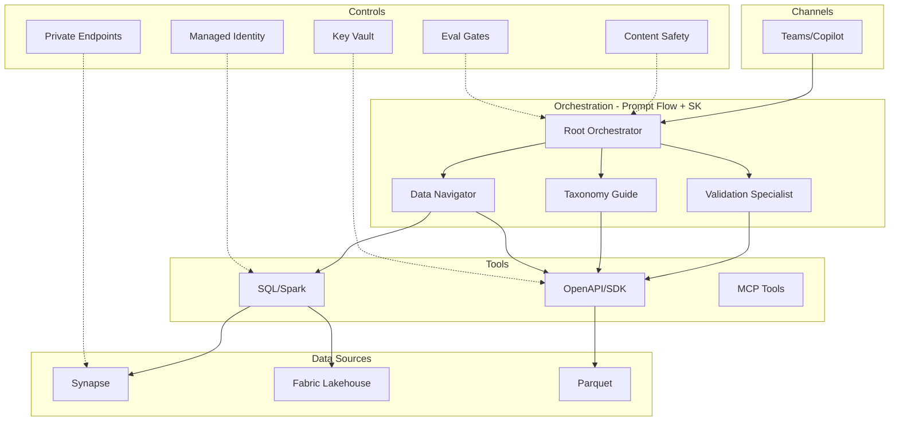
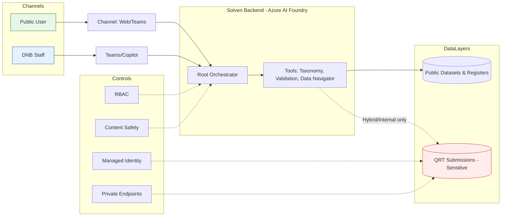
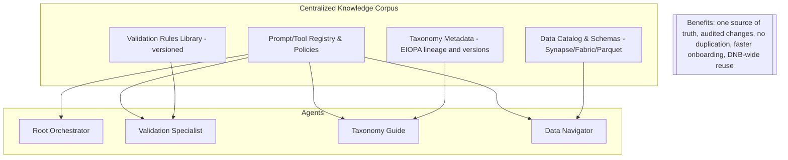

# Solven – DNB’s Agentic AI Assistant

A two-part brief for non-technical and technical readers.

- Part 1 – Meet Solven (plain-language)
- Part 2 – Technical Appendix (deep-dive, architecture, governance)

---

## Table of Contents

- Part 1 – Meet Solven
  - Why Solven Exists
  - How Solven Helps Us
  - The Team Behind Solven: Three Specialist Sub‑Agents
  - FAQ
  - Engagement and Support
- Part 2 – Technical Appendix
  - Appendix A – Vision Overview
  - Microsoft-First Architecture Enablers
  - Why Azure AI Foundry and not Copilot Studio?
    - At-a-Glance Benefits
    - Feature Comparison Matrix
    - Pros and Cons
    - Coexistence Pattern
  - Agent Catalog
  - Representative Use Cases
  - KPIs
  - Risks & Mitigations
  - Readiness Checklist (Pre-Build)
  - References
  - Open Questions for Architecture and Operations
  - Appendix B – Multi‑Agent Orchestration Architecture
  - Appendix C – Data Source Connectivity Matrix
  - Appendix D – Conversation Journey (Mermaid)
  - Appendix E – Agent Mesh Topology (Mermaid)
  - Appendix F – Bridging and Related Docs
  - Appendix G – Comparison Tables (CSV for Excel)
  - Appendix H – Deployment Modes and Data Boundary (Mermaid)
  - Appendix I – Centralized Knowledge Corpus (Mermaid)

---

## Part 1 – Meet Solven

### Why Solven Exists
Solven is our digital colleague that answers supervision questions by talking to the same governed data sources we use. Think of it as a supervision control tower: it watches multiple information “flight paths” at once, applies the house procedures, and directs the right specialist to land a well‑cited answer safely and on time.

- Goal: Faster, cited answers; less time chasing data; more time for judgment.
- Pilot sponsor: ECDAP (initial deployment; designed for broader DNB adoption).

### How Solven Helps Us
- Colleagues will ask in plain language. Example: “What’s the latest reported solvency ratio for FI X, and how does it compare quarter-over-quarter?”
- Solven looks into:
  - Public datasets and registers
  - Internal sources such as Synapse/Fabric lakehouse and Azure parquet archives
  - Approved APIs exposed with managed identity
- The team receives a cited answer with links to sources and a short reasoning trail.

What stays the same
- Experts remain in control. Solven proposes; reviewers approve.
- Sensitive actions follow established approval flows.
- Data access respects existing RBAC and least‑privilege rules.

### Centralized knowledge, shared across DNB (no more duplicated “mini agents”)
- Single governed corpus: Taxonomy metadata, validation rules, schemas, and canonical dataset locations live once and are reused by all agents and teams.
- Versioned and auditable: Changes to rules/taxonomy are reviewed, versioned, and rolled out consistently (no drift across departments).
- Fewer silos: Instead of each team building one‑off copilots and copying knowledge, Solven exposes shared capabilities via tools/APIs and Teams/Copilot.
- Faster onboarding: New use cases plug into the same corpus and policies, reducing time‑to‑value.

### The Team Behind Solven: Three Specialist Sub‑Agents
- Validation Specialist
  - Plain-English: Our spell‑checker for insurance and pension data quality.
  - Focus (DNB context): QRT completeness/timeliness checks, cross‑table consistency, common EIOPA validation rules, late/missing filings, supervisory materiality thresholds.
- Taxonomy Guide
  - Plain-English: Tracks taxonomy evolutions and explains how a data point changed over time.
  - Focus (DNB context): EIOPA taxonomy lineage and deprecations, mapping candidates for KPI continuity, impact analysis for historical comparisons and methodology changes.
- Data Navigator
  - Plain-English: Knows where each dataset lives—Synapse, Fabric, parquet—and fetches the freshest numbers.
  - Focus (DNB context): Source resolution across governed stores, freshness/SLA checks, row‑level security alignment to user roles, cost/fan‑out hints for complex queries.

Analogy
- Imagine an orchestra: Solven is the conductor. It cues the right section (Validation, Taxonomy, Data Navigation), keeps tempo (policies and approvals), and produces a reliable performance (cited answers).

### FAQ
- What data will Solven access?
  - Only what assigned roles allow. Entra ID and managed identities enforce least privilege.
- How will we validate answers?
  - Check citations; ask Solven to show the validation checks it applied.
- What about sensitive information?
  - Safety filters, redaction, and governance gates are applied before tool/database actions.
- How do we report issues?
  - Open a ticket in the team channel or contact the product owner/security liaison listed below.

### Engagement and Support
- Access will be provided during pilot via the standard app catalog entry.
- Requirements: Entra ID account, RBAC aligned to governed sources.
- Support: Product Owner, Solution Architect, Security/Privacy contact.
- See Appendix C for the deployment and rollout plan in Azure AI Foundry.

---

## Part 2 – Technical Appendix

### Appendix A – Vision Overview
<!-- Previous full document content begins here, now nested under Appendix A.
     Keep the text unchanged except for heading levels as needed. -->

# Why Agentic AI – Management Brief

Purpose: Recommend adoption of agentic AI aligned with Microsoft-first strategy; outline value, risks, and fit, with an initial focus on Insurance and Pension funds.

Audience: Leadership, IT, Security, Supervision, Data & Analytics.

## Executive Summary

- Agentic AI reduces cycle time and handoffs for supervisory and data tasks with full auditability.
- An initial high-value use case is a Database Agent that lets non‑technical users query governed data in natural language; this can expand into a multi‑agent system as needs mature.
- Works in familiar channels (Teams/Copilot) with enterprise identity, safety, and governance.
- Expected outcomes: faster answers, higher-quality, cited outputs, and better analyst leverage.

## What Is Agentic AI and Why It Matters

- Definition: An agent is a governed software component using large language
  model (LLM) reasoning to plan, invoke tools/APIs, and coordinate tasks.
- Maturity: Microsoft agentic frameworks integrate planning (Semantic Kernel “agents”) and multi‑agent patterns (AutoGen).
- Fit: Supervisory workflows (cross-database reconciliation, regulatory change impact, document analysis) require tool use plus policy controls.
- Platform: Azure AI Foundry supplies orchestration, evaluation, deployment, and identity integration.

### Component-Level vs System-Level

- AI agent (single actor): Bounded task, minimal planning, local state.
- Agentic AI (system): Goal-driven orchestration, branching, retries, verification, shared session state, centralized policies.
- Example difference:
  - Single agent: “Query DataLoop for report X.”
  - System: “Compare FI X status across DataLoop/MEGA/ATM, reconcile differences, draft cited brief.”

### Governance Shift

- Moves from model-centric testing to full path validation (intent → plan →
  tool executions → output).
- Foundry evaluation (groundedness, relevance) plus Content Safety gating
  precede sensitive actions.
- Identity: Azure Entra ID + Managed Identities across all calls; unified
  telemetry in Application Insights (App Insights) and Azure Log Analytics.

## Microsoft-First Architecture Enablers

- Secure-by-default identity and access (single sign-on, role-based access).
- Safety and governance controls (content safety, logging, approvals).
- Integration with productivity tools (Teams/Copilot) for fast adoption.
- Reuse existing, governed data sources and dashboards (no new platforms required at pilot).

## Why Azure AI Foundry and not Copilot Studio?

- TL;DR: Use Copilot Studio for lightweight, M365-first experiences and citizen-development. Use Azure AI Foundry for governed, multi-agent, tool-heavy backends that require private networking, managed identity, evaluation gates, and CI/CD.

### At-a-Glance: Benefits of Azure AI Foundry vs Copilot Studio
| Benefit | Azure AI Foundry | Copilot Studio |
|---|---|---|
| Private networking and data perimeter (VNets, Private Endpoints) | First-class (Hub/Project, PE across LLM/data) | Limited; primarily M365 runtime |
| End-to-end identity (Entra ID, Managed Identity for tools/DBs) | Native MI + Key Vault, service-to-service | Strong for user-delegated M365; MI limited for custom backends |
| Multi-agent orchestration (branching, retries, tool-first) | Prompt Flow + Semantic Kernel; AutoGen patterns | Actions/plugins; limited complex orchestration |
| Evaluation gates (groundedness/relevance) before actions | Built-in offline/online eval; gating patterns | Responsible AI features; limited pre-action gates |
| Observability and audit (App Insights/Log Analytics) | Full tracing with correlation IDs | Runtime telemetry focused on M365 experiences |
| CI/CD, versioning, multi-env (dev/test/prod) | Projects/Hubs, IaC (Bicep/Terraform), rollouts | ALM via Power Platform solutions |
| Model/provider portability | Any model/provider via SDK/endpoints | Primarily M365/Copilot context |
| Internal APIs/tools (OpenAPI, SDK, DB with MI) | Direct integration, standardized tool schemas | Connector-first; custom connectors via Power Platform |
| Cost control and scale-out | Explicit attribution, autoscale patterns | Simpler, tied to M365 usage and connectors |

### Feature comparison matrix (multi-agent development focus)
| Area | Azure AI Foundry | Copilot Studio |
|---|---|---|
| Orchestration runtime | Prompt Flow, Semantic Kernel (SK); DAGs, retries, tool-first planning | Prompts + actions/plugins; simpler branching |
| Multi-agent patterns | SK agents/planners; AutoGen; agent-to-agent via APIs | Single copilot with actions; basic composition |
| Tooling for internal systems | OpenAPI/MCP/SDK tools; MI to DBs/APIs; private networking | Power Platform connectors; custom connectors; limited MI |
| Identity | Managed Identity, Entra ID, Key Vault; service principals | User-delegated auth; strong for M365 |
| Evaluations | Groundedness/relevance evals; offline/online; gates in flows | Responsible AI/testing; fewer gated eval flows |
| Observability | App Insights, Log Analytics, KQL, correlation IDs | M365-centric telemetry |
| DevX/SDKs | Python/.NET SDKs, CLI, local dev; Prompt Flow authoring | Low-code studio, solution export |
| CI/CD | Hub/Project promotion; IaC; canary/rollback | Power Platform ALM |
| Data residency/perimeter | EU regions, PE to LLM + data, VNet | M365 runtime perimeter |
| Teams/Copilot integration | Expose secure backend APIs as plugins/actions | Native copilot in M365; fastest UX delivery |

### Pros and cons
| Platform | Pros | Cons |
|---|---|---|
| Azure AI Foundry | Maximum control; MI + PE; multi-agent orchestration; eval gates; observability; portability; CI/CD | Higher engineering lift; more infra to manage; steeper learning curve |
| Copilot Studio | Fastest time-to-value in M365; low-code; user-delegated access; simple ALM | Limited for complex multi-agent and MI-backed internal APIs; less perimeter control |

### Coexistence pattern (recommended)
- Frontend: Copilot/Teams (Copilot Studio for UX where helpful).
- Backend: Agentic services in AI Foundry (Prompt Flow/SK) with tools, evaluations, and governance.
- Integration: Expose backend APIs to Copilot via secure plugins/actions; keep Teams UX while centralizing orchestration, identity, and audit in Foundry.

Mermaid diagram – Coexistence (frontend/backends)

## Agent Catalog (Initial Focus: Insurance & Pension)

- Root Orchestrator: Entry, routing, policy enforcement.
- Coordinators: Internal Services; External Regulatory; Data & Analytics.
- Database Agent (New): Conversational access to governed datasets for non‑technical users; turns natural language into safe, approved queries and returns cited answers.
- Specialists: DataLoop, MEGA, ATM; Taxonomy (EIOPA RAG); Statistics; Public Registers; Analytics‑to‑Brief; Document Ingestion; API Concierge; Entity Resolution; Case Triage; Compliance Guard.
- Validation Specialist: Explains validation logic; assists natural‑language authoring and review of new rules with change control (positioned for later phase).
- Guardrails: Identity, safety filters, evaluation gates, centralized tracing.

## Representative Use Cases

1) Supervision Report Status Assistant – Consolidate status + validation notes with sources.  
2) Taxonomy Agent – Detect taxonomy deltas, propose mapping changes.  
3) Policy & Market Intelligence – Macro trends + cited data.  
4) Internal API Concierge – Locate authoritative endpoints and auth method.  
5) Analytics‑to‑Brief – Summarize material dashboard shifts.  
6) Entity Resolution – Canonical ID with confidence + lineage.  
7) Case Triage – Classify, enrich, and route with audit metadata.  
8) Database Q&A (New) – Ask questions in natural language and get cited answers from governed datasets without writing SQL.  
9) Validation Authoring & Coverage (Later) – NL→Validation authoring, proposal and review with change control.

All responses are source‑grounded; human‑in‑the‑loop (HITL) for sensitive outputs.

## Business Value and Key Performance Indicators (KPIs)

- Productivity: 30–60% cycle time reduction on targeted tasks.
- Quality: Cited, policy‑aligned outputs.
- Adoption: Weekly active users and repeat usage in Teams/Copilot.
- Satisfaction: CSAT ≥4.2/5.

KPIs:
- Time‑to‑answer vs baseline (by use case).
- Citation/grounding rate ≥0.8 (sampled reviews).
- Manual correction rate <10% after week 8.
- Analyst hours shifted from collection to judgment.

## Risks & Mitigations

- Incorrect actions: Tool‑first prompting, verification steps, HITL for sensitive flows.
- Data leakage / PII: Safety gating, redaction, private networking, no training on sensitive data.
- Access control gaps: Role‑based access, least privilege, approvals.
- Drift: Versioned flows, canary rollout, telemetry and feedback loops.

## Readiness Checklist (Pre-Build)

- Clear outcomes and decision rights (advisory vs action; HITL points).
- Authoritative data sources, freshness, and citation expectations.
- Identity scopes, residency, and retention.
- Safety classification, PII handling, audit scope and review cadence.
- Channels and change management (Teams/Copilot, ACA), cost envelope.
- Reusable patterns and governance (approvals, logging, rollout gates).

## References

- Azure AI Foundry (orchestration, evaluation, deployment).
- Microsoft Copilot (end‑user channel).
- Governance: GDPR, NIS2, DORA via identity, safety, encryption, and audit.
- Local repositories (capabilities and samples used in this design):
  - C:\Users\rjjaf\_Projects\agent-framework
  - C:\Users\rjjaf\_Projects\foundry-samples
  - C:\Users\rjjaf\_Projects\mcp-foundry
- Public, authoritative repos:
  - Semantic Kernel (agents, planning): https://github.com/microsoft/semantic-kernel
  - AutoGen (multi-agent patterns): https://github.com/microsoft/autogen
  - Azure AI Foundry Samples (Prompt Flow, Agents, evals): https://github.com/Azure/azureai-samples

## Open Questions for Architecture and Operations

- Organization & Collaboration
  - Central ownership: Which central team leads Agentic AI (sponsor,
    product/owner, platform)?
  - Collaboration model with supervision domains and IT (cadence,
    working agreements, decision forum)?
  - Roles and staffing (pilot → scale).
  - Capacity & timeline (indicative).
  - Artifacts: RACI, roadmap/backlog, DoD/acceptance criteria, decision log.
  - Ways of working: PR‑based change control, weekly demos, design reviews,
    incident/DR exercises.

- Identity & Access
  - Authentication to Azure SQL/PostgreSQL (Managed Identity vs user-delegated)?
  - RBAC per agent and per tool; least privilege reviews?
  - Cross-tenant or guest access for inter-agency collaboration?

- Data Residency, Retention, and Privacy
  - EU region(s), CMK, encryption posture for services.
  - Retention/deletion policies for chats, event logs, artifacts; PII redaction.

- Networking & Connectivity
  - Private endpoints/VNet (ACA, databases, Key Vault, OpenAI endpoints).
  - DNS, firewall rules, allowlists for internal APIs and databases.

- Secrets, Keys, and Credentials
  - MI-first posture; secrets rotation and access reviews via Key Vault.

- Safety & Compliance
  - Content Safety thresholds; HITL approvals.
  - Recording safety decisions without storing sensitive payloads.

- Observability & Audit
  - App Insights/Log Analytics schema, sampling, correlation IDs.
  - KQL queries/dashboards for security and compliance.

- Models & Orchestration
  - Baseline model choice and fallbacks; evaluation metrics.
  - Prompt Flow vs Semantic Kernel selection; versioning and rollouts.

- Tools & Internal APIs
  - Authoritative APIs with OpenAPI specs; rate limit and error contracts.
  - Standardized tool schemas across agents.

- Databases & Data Warehouse
  - Catalog of governed datasets; RLS/masking policies.
  - Query cost controls, caching, synthetic datasets for evals/smoke tests.

- Teams/Copilot Integration
  - Channels (bot, message extensions, plugins) and per-request authorization.

- Agent-to-Agent (A2A) Interactions
  - Agent card format, registry location, auth model for cross-department calls.
  - Audit and rate-limit cross-org calls.

- Cost & Operations
  - Cost tags, budgets, autoscaling thresholds, cold start mitigation for ACA.
  - Quota management for model and data services.

- Change Management & Governance
  - PR-based change control for prompts, tools, and flows; reviewers; canary/rollback.
  - Incident response runbooks, DR (RTO/RPO), backup/restore.

- Legal & Procurement
  - Data Processing Agreements and EU data boundary requirements.
  - Licensing for connectors, SDKs, and third-party components.

### Appendix B – Multi‑Agent Orchestration Architecture
- Orchestration pattern
  - Root agent plans and delegates to specialists via tool-first prompting and retries.
  - Multi-agent coordination follows Semantic Kernel/Prompt Flow patterns with evaluation gates.
  - Identity: End-to-end Entra ID; managed identities for databases/APIs; Key Vault for secrets.
- Sub-agent responsibilities and contracts
  - Validation Specialist
    - Inputs: dataset identifier, period, entity scope, validation profile.
    - Contract: Validation DSL (rule_id, predicate, severity, remediation_hint).
    - Outputs: issues[], coverage metrics, provenance.
  - Taxonomy Guide
    - Inputs: datapoint id/version, filing period, domain.
    - Contract: Taxonomy metadata (concept, lineage, deprecation, mapping candidates).
    - Outputs: version deltas, migration hints, confidence, citations.
  - Data Navigator
    - Inputs: query intent, freshness requirements, user role.
    - Contract: Storage endpoints (Synapse, Fabric lakehouse, parquet URIs), schema hints, RLS filters.
    - Outputs: resolved source, query plan, row-count estimate, cost hints.
- Orchestration triggers
  - Trigger Validation when the answer affects regulated KPIs or when risk score > threshold.
  - Trigger Taxonomy on datapoints tied to evolving concepts or historical comparisons.
  - Trigger Data Navigator when multiple candidate sources exist or freshness is uncertain.
- Evaluation and safety
  - Groundedness/relevance checks in Prompt Flow before sensitive actions.
  - Content Safety filters on user prompts and tool outputs.
- Observability
  - Tracing via App Insights and Log Analytics with correlation IDs (user → agent → tool → DB).

Mermaid diagram – Backend orchestration

### Appendix C – Data Source Connectivity Matrix
| Agent            | Public APIs | Synapse (SQL/Spark) | Fabric Lakehouse | Azure Parquet Containers | Auth Method            | Scope         |
|------------------|------------|---------------------|------------------|--------------------------|------------------------|---------------|
| Root Orchestrator| Read       | Read                | Read             | Read                     | Entra ID (user), MI    | Read-only     |
| Validation Spec. | Optional   | Read                | Read             | Read                     | Managed Identity (MI)  | Read-only     |
| Taxonomy Guide   | Read       | Optional Read       | Optional Read    | Optional Read            | MI + Key Vault if any  | Read-only     |
| Data Navigator   | Read       | Read                | Read             | Read                     | MI + Private Endpoints | Read-only     |

Notes
- No write operations in pilot phase.
- Private networking and PE on LLM endpoints and data stores where required.
- RBAC at source level; row-level security enforced by source.

### Appendix D – Conversation Journey (Mermaid)

### Appendix E – Agent Mesh Topology (Mermaid)

### Appendix F – Bridging and Related Docs
- [Azure AI Foundry documentation](https://learn.microsoft.com/en-us/azure/ai-foundry/)
- [Semantic Kernel documentation](https://learn.microsoft.com/en-us/semantic-kernel/)
- [AutoGen documentation](https://learn.microsoft.com/en-us/azure/ai-foundry/agentic-ai-autogen)
- [DNB Data Governance](https://dnb.sharepoint.com/sites/DataGovernance)

### Appendix G – Comparison Tables (CSV for Excel)
- [Download comparison tables](https://github.com/Azure/azureai-samples/blob/main/AgenticAI/Comparison%20Tables/)

### Appendix H – Deployment Modes and Data Boundary (Mermaid)

### Appendix I – Centralized Knowledge Corpus (Mermaid)

## Part 1 – Meet Solven

### Benefits for the ECDAP pilot (plain-language)
- Single source of truth: Everyone uses the same taxonomy and validation rules.
- Faster answers with citations: Less time locating data, more time for supervisory judgment.
- Safer by design: RBAC + Managed Identity + Private Endpoints; QRT access remains internal.
- Easy to expand: Add new agents/tools without duplicating knowledge or policies.
